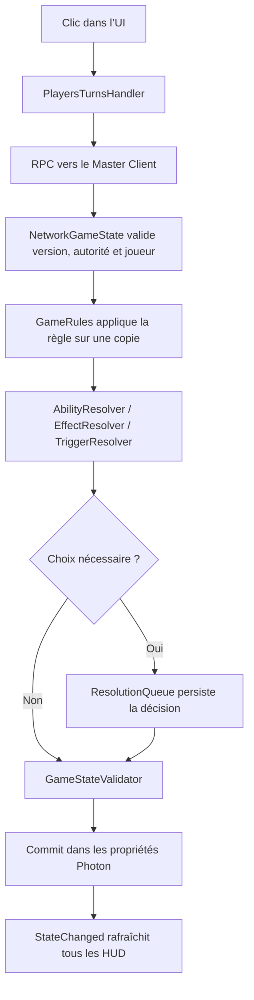

# Dominion Unity — Guide de maintenance et lexique technique

> Mise à jour UI : voir [Choix interactifs — réglages des prefabs et tests](decision_workspace.md) pour la nouvelle zone de résolution. Les anciennes entrées de décision ci-dessous restent utiles pour les contrôles spécialisés et le fallback.

> Référence analysée : dépôt `boulou-git/Dominion`, branche `fleaux`, commit `66fd85beb415f8441b39e2e55700e0b9fc18f8a9` (12 septembre 2026).  
> Projet Unity : dossier `Dominion/` dans le dépôt. Version de l’éditeur : **Unity 6000.3.21f1**.

Ce document répond à deux questions :

1. **Que fait chaque partie du projet ?**
2. **Si je veux changer un comportement, quel fichier dois-je modifier ?**

Il couvre tous les fichiers de code propres au projet, les données de cartes, les scènes, les prefabs UI, les ressources importantes, les tests et les réglages structurants. Les milliers de fichiers internes de Photon, TextMesh Pro et des packages Unity ne sont pas détaillés un par un : ils sont regroupés comme dépendances tierces et ne doivent normalement pas être modifiés.

---

## Sommaire

1. [Le projet en une minute](#1-le-projet-en-une-minute)
2. [Index de maintenance : je veux modifier X](#2-index-de-maintenance--je-veux-modifier-x)
3. [Arborescence et sources de vérité](#3-arborescence-et-sources-de-vérité)
4. [Flux complet d’une action de jeu](#4-flux-complet-dune-action-de-jeu)
5. [Cartes et extensions JSON](#5-cartes-et-extensions-json)
6. [Lexique du moteur déclaratif](#6-lexique-du-moteur-déclaratif)
7. [État de partie et réseau Photon](#7-état-de-partie-et-réseau-photon)
8. [Moteur de règles — fichier par fichier](#8-moteur-de-règles--fichier-par-fichier)
9. [Interface et présentation — fichier par fichier](#9-interface-et-présentation--fichier-par-fichier)
10. [Scripts racine et scripts hérités](#10-scripts-racine-et-scripts-hérités)
11. [Scènes, prefabs et ressources](#11-scènes-prefabs-et-ressources)
12. [Outils Editor](#12-outils-editor)
13. [Tests EditMode](#13-tests-editmode)
14. [Réglages Unity et dépendances](#14-réglages-unity-et-dépendances)
15. [Recettes de modification](#15-recettes-de-modification)
16. [Diagnostic : partir d’un bug vers le bon fichier](#16-diagnostic--partir-dun-bug-vers-le-bon-fichier)
17. [Glossaire](#17-glossaire)
18. [Inventaire des cartes et assets](#18-inventaire-des-cartes-et-assets)

---

## 1. Le projet en une minute

L’architecture repose sur quatre couches nettement séparées :

| Couche | Source principale | Responsabilité |
|---|---|---|
| Données | `Assets/StreamingAssets/Extensions/*/extension.json` | Nom, coût, types, texte, image et effets des cartes. |
| Règles | `Assets/Scripts/Rules/` | Transformations déterministes de l’état : jouer, acheter, piocher, écarter, gagner, résoudre les effets et choix. |
| Autorité réseau | `Assets/Scripts/Network/NetworkGameState.cs` | Le Master Client valide les commandes, modifie une copie de l’état, la valide puis la réplique. |
| Présentation | `Assets/Scripts/HUD/` et `Assets/Resources/UI/` | Affiche l’état répliqué, collecte les clics et envoie des demandes ; ne doit pas inventer de règles. |

La règle mentale essentielle est la suivante :

> **Le JSON décrit ce qu’une carte demande ; les règles savent comment l’exécuter ; `NetworkGameState` est seul autorisé à publier le nouvel état ; l’UI ne fait que montrer et demander.**

Une carte physique est séparée de sa définition :

- `ExtensionCardData` = définition immuable d’une carte (nom, coût, types, effets) ;
- `CardInstance` = exemplaire physique unique pendant une partie (`InstanceId`, `DefinitionId`, propriétaire) ;
- les zones du joueur ne stockent que des `InstanceId` ;
- `GameStateSnapshot.CardInstances` est le registre central de toutes les cartes physiques.

---

## 2. Index de maintenance : je veux modifier X

Cet index est volontairement redondant avec le reste du document : il sert de **moteur de recherche humain**. Chercher un mot visible à l’écran — « surbrillance », « phase », « zoom », « chat », « pile vide » — puis suivre la ligne correspondante.

Les chemins abrégés utilisés ci-dessous partent de `Assets/Scripts/` :

- `HUD/...` = présentation et interaction locale ;
- `Network/...` = état partagé et autorité Photon ;
- `Rules/...` = règle déterministe ;
- `JSON` = `Assets/StreamingAssets/Extensions/<extension>/extension.json` ;
- `Prefab` = `Assets/Resources/UI/<nom>.prefab`.

La colonne **Type** indique si la modification se fait dans le code, l’Inspector Unity, un prefab ou les données JSON.

### 2.1 Réserve, cartes achetables et phase Achat

| Je veux modifier… | Emplacement exact | Type | Ce qui contrôle réellement le comportement |
|---|---|---|---|
| Couleur de la surbrillance dorée des cartes achetables | `HUD/SupplyPileInteractionBinding.cs` → `RefreshAvailabilityVisual()` → `_outline.effectColor` | Code | Actuellement `new Color(1f, 0.78f, 0.18f, 0.90f)`. C’est **la réponse exacte** pour changer le highlight d’achat. |
| Épaisseur/décalage de ce highlight | Même méthode → `_outline.effectDistance` | Code | Actuellement `(3f, -3f)`. L’effet est un `UnityEngine.UI.Outline`. |
| Supprimer complètement le contour des cartes achetables | Même méthode → condition `_outline.enabled = _hasCards && _buyable && !_purchaseAnimationRunning` | Code | Retirer/remplacer l’Outline sans toucher au calcul `_buyable`. |
| Couleur d’une carte achetable/disponible | `SupplyPileInteractionBinding.cs` → `AvailableColor` | Code | Blanc (`Color.white`) : l’artwork garde sa couleur normale. |
| Couleur grisée d’une carte non achetable | Même fichier → `UnavailableColor` | Code | `(0.68, 0.68, 0.68, 1)`. |
| Couleur d’une pile vide | Même fichier → `EmptyColor` | Code | `(0.42, 0.42, 0.42, 1)`. |
| Critères précis pour qu’une carte soit achetable | `HUD/BuyPhaseGameplayController.cs` → `RefreshSupplyStates()` → variable `buyable` | Code/règle UI | Définition résolue + pile connue et non vide + tour local + phase Achat + partie non en pause + au moins 1 Achat + coût effectif compris entre 0 et les Pièces. |
| Validation autoritaire d’un achat | `Rules/GameRules.cs` → `TryBuyCard()` | Règle | Exige phase Achat, `Buys > 0`, coût effectif payable, pile gagnable/non vide. Dépense Pièces/Achat puis gagne vers Défausse. |
| Coût effectif utilisé pour le highlight et l’achat | `Rules/CostRules.cs` → `GetEffectiveCost()` | Règle | Coût imprimé moins `CostReductionThisTurn`, avec plancher 0. |
| Réduction des coûts pendant le tour | `Rules/CostRules.cs` → `AddReductionForCurrentTurn()` ; op JSON `reduce_costs_this_turn` | Règle/JSON | Utilisée par Pont. Le reset se fait au changement de tour. |
| Texte du coût dynamique sur les cartes | `HUD/DynamicCardCostView.cs` ; prefab `CardCostOverlay.prefab` | Code/Prefab | `RefreshCost()` prend toujours le coût effectif. Le prefab contrôle position, police et taille. |
| Position du coût sur la carte de Réserve | `SupplyCard.prefab` → enfant `DynamicCost` / prefab `CardCostOverlay.prefab` | Prefab | Ne pas changer le calcul dans `DynamicCardCostView` pour un simple déplacement. |
| Quantité affichée sur une pile | `SupplyPileInteractionBinding.SetRemaining()` ; `RuntimeCardView.SetRemainingCount()` | Code | L’état réel vient de `SupplyPileSnapshot.RemainingCount`. Le badge est forcé visible par `EnsureCountBadgeVisible()`. |
| Style/position du compteur de pile | `SupplyCard.prefab` ou `RuntimeCard.prefab` → `RemainingCount/Text` | Prefab | Garder ce nom/référence : le binding le recherche explicitement. |
| Critères visuels d’une pile inconnue pendant le chargement | `SupplyPileInteractionBinding.RefreshAvailabilityVisual()` → branche `!_quantityKnown` | Code | La carte reste neutre/blanche au lieu d’apparaître vide. |
| Action au clic gauche sur une pile | `SupplyPileInteractionBinding.OnPrimaryAction()` | Code | En Achat : animation puis `PlayersTurnsHandler.BuyCard`. Pendant un choix : sélection de définition au lieu d’achat. |
| Action au clic droit sur une pile | `SupplyPileInteractionBinding.OnInspect()` | Code | Ouvre le zoom sans acheter. |
| Durée de l’animation d’achat | `SupplyPileInteractionBinding.PurchaseAnimationRoutine()` → `duration` | Code | 0,34 s. |
| Hauteur de l’arc de l’animation d’achat | Même routine → `Mathf.Sin(...) * 24f` | Code | 24 pixels/unités UI. |
| Taille finale de la carte volante achetée | Même routine → `Vector3.one * 0.58f` | Code | Échelle finale avant destruction. |
| Destination de l’animation d’achat | Même routine → recherche de l’objet `Discard` | Code/Prefab | Le nom `Discard` dans `GameScreen.prefab` est contractuel. |
| Autoriser l’achat dans une autre phase | `GameRules.TryBuyCard()` **et** `BuyPhaseGameplayController.RefreshSupplyStates()` | Règle + UI | Modifier les deux : l’UI seule n’autorise pas le Master, la règle seule laisserait l’UI grisée. |
| Faire arriver les achats ailleurs qu’en Défausse | `GameRules.TryBuyCard()` → appel `GainRules.TryGainFromSupply(... CardZone.Discard ...)` | Règle | Vérifier les déclencheurs `card_gained` et le journal. |
| Passer automatiquement au Nettoyage après le dernier Achat | `GameRules.TryBuyCard()` → `if (p.Buys <= 0) s.Phase = CleanupPhase` | Règle | Le passage d’état est autoritaire. L’animation est ensuite lancée par le HUD. |
| Critères de lancement auto de l’animation de Nettoyage | `BuyPhaseGameplayController.Refresh()` → `explicitCleanup` / `noRemainingBuys` | UI | Tour local, pas en pause, pas déjà en animation, phase Cleanup **ou** phase Buy avec `Buys <= 0`, une seule fois par version. |
| Durée de l’animation main/en jeu vers Défausse | `BuyPhaseGameplayController.CleanupAnimationRoutine()` → `duration` | Code | 0,32 s, puis délai final de 0,08 s. |
| Taille finale pendant l’animation de Nettoyage | Même routine → `Vector3.one * 0.32f` | Code | Toutes les cartes visuelles convergent vers `Discard`. |
| Jouer automatiquement tous les Trésors | Aucun automatisme actuel | Nouvelle règle/UI | Point de départ : `BuyPhaseGameplayController.BindHandGameplay()` et `PlayersTurnsHandler.PlayCard()`. La règle autoritaire reste `GameRules.TryPlayCard()`. |
| Déterminer quels Trésors sont jouables en Achat | `BuyPhaseGameplayController.BindHandGameplay()` → `IsTreasure()` | UI | Tour local + phase Achat + non-paused + type `Trésor`. La règle confirme dans `GameRules.ValidatePlayPolicy()`. |

### 2.2 Phases, changements de phase et déroulement d’un tour

#### Carte exacte des transitions actuelles

| Transition | Déclencheur actuel | Fichier et méthode |
|---|---|---|
| Initialisation → Action | Création de la partie ; premier joueur reçoit 1 Action, 1 Achat, 0 Pièce | `Network/NetworkGameState.cs` → `InitialiseAuthoritativeState()` |
| Action → Achat manuel | Clic sur le bouton de phase | `BuyPhaseGameplayController.BeginCleanupAnimation()` puis `PlayersTurnsHandler.AdvancePhase()` puis `NetworkGameState.TryAdvancePhase()` |
| Action → Achat automatique | 0 Action restante **ou** aucune Action dans la main | `PlayersTurnsHandler.Update()` + `ShouldAutoAdvanceActionPhase()` |
| Action → Achat par une carte | Opération JSON `end_action_phase` | `Rules/EffectResolver.cs` → `EndActionPhase()` |
| Achat → Cleanup après achat | Le dernier Achat est consommé (`Buys <= 0`) | `Rules/GameRules.cs` → fin de `TryBuyCard()` |
| Achat → Nettoyage manuel | Clic sur « Passer à l’ajustement » | `BuyPhaseGameplayController.BeginCleanupAnimation()` → animation → `AdvancePhase()` |
| Cleanup → décision de fin de tour | Un effet `turn_ended` demande un choix | `NetworkGameState.PerformCleanupAndAdvance()` + `TurnLifecycleRules.TryResolveTurnEnded()` |
| Cleanup → joueur suivant | Tous les effets de fin sont résolus, cartes défaussées, nouvelle main piochée | `NetworkGameState.PerformCleanupAndAdvance()` |
| Joueur suivant → Action | Rotation du joueur, reset de ses compteurs, résolution de `turn_started` | Même méthode + `TurnLifecycleRules.TryResolveTurnStarted()` |
| Fin de tour → GameOver | Province vide ou au moins 3 piles vides après le Nettoyage | `Rules/GameEndRules.cs` → `TryFinaliseAtTurnBoundary()` |

#### Réglages et critères détaillés

| Je veux modifier… | Emplacement exact | Type | Critères/conséquences |
|---|---|---|---|
| Critères du passage automatique Action → Achat | `PlayersTurnsHandler.cs` → `ShouldAutoAdvanceActionPhase()` | Code | Doit être le joueur local actif, partie démarrée/non pausée, aucune résolution active, phase Action. Ensuite auto si `Actions <= 0`, main vide, ou aucune définition de type Action trouvée. Une carte introuvable désactive prudemment l’auto. |
| Désactiver entièrement ce passage automatique | `PlayersTurnsHandler.Update()` | Code | Supprimer/conditionner l’appel à `ShouldAutoAdvanceActionPhase`, sans toucher au bouton manuel. |
| Ajouter un délai avant le passage automatique | `PlayersTurnsHandler.Update()` | Code | Ajouter un timer local, mais conserver `_lastAutoAdvanceVersion` pour éviter plusieurs RPC. |
| Considérer certaines Actions comme injouables pour l’auto | `ShouldAutoAdvanceActionPhase()` | Code/règle | Aujourd’hui seule la présence du type `Action` est testée, pas le coût ou d’autres préconditions. Créer une fonction partagée de jouabilité si ce critère devient complexe. |
| Empêcher l’auto pendant un choix/effet | Déjà géré par `CanSendActivePlayerCommand()` | Code | Exige que la résolution soit absente ou inactive. Ne pas retirer cette sécurité. |
| Nombre d’Actions au début du tour | `NetworkGameState.InitialiseAuthoritativeState()` et `PerformCleanupAndAdvance()` | Code | Valeur actuelle 1 aux deux endroits. Les modifier ensemble ou créer une constante. |
| Nombre d’Achats au début du tour | Mêmes méthodes | Code | Valeur actuelle 1. |
| Nombre de Pièces au début du tour | Mêmes méthodes | Code | Valeur actuelle 0. |
| Libellés visibles ACTION / ACHAT / AJUSTEMENT | `HUD/GameScreenController.cs` → `PhaseLabel()` **et** `HUD/PublicJournalView.cs` → `PhaseLabel()` | Code | Deux fonctions parallèles : les modifier ensemble. |
| Libellé du bouton de phase | `GameScreenController.cs` → `NextPhaseLabel()` | Code | Action : « PASSER À L’ACHAT » ; Buy : « PASSER À L’AJUSTEMENT » ; Cleanup : « TERMINER LE TOUR » ; autre joueur : « EN ATTENTE ». |
| Quand le bouton de phase est cliquable | `GameScreenController.Refresh()` → `_nextPhaseButton.interactable` | UI | Tour local + partie démarrée + non pausée. |
| Action réelle du bouton | `BuyPhaseGameplayController.HookCleanupButton()` / `BeginCleanupAnimation()` | UI/commande | En Action : transition immédiate. En Buy/Cleanup : animation puis transition. |
| Ordre Action → Buy → Cleanup | `NetworkGameState.TryAdvancePhase()` | Règle réseau | `ActionPhase` commit directement `BuyPhase`; `BuyPhase` et `CleanupPhase` appellent le Nettoyage complet. |
| Ajouter une quatrième phase | `GameRules` constantes, `GameStateSnapshot.Phase`, `NetworkGameState.TryAdvancePhase`, HUD `PhaseLabel/NextPhaseLabel`, règles de jouabilité et tests | Architecture | Modification transversale ; ne pas l’ajouter uniquement à l’affichage. |
| Jouer une Action pendant la phase Action | `GameRules.ValidatePlayPolicy()` | Règle | Type `Action` obligatoire et `Actions > 0`; consomme une Action. |
| Jouer un Trésor pendant la phase Achat | Même méthode | Règle | Type `Trésor` obligatoire ; ne consomme pas d’Action. |
| Autoriser d’autres types à être joués | `ValidatePlayPolicy()` + critères UI dans `HandGameplayInteraction`/`BuyPhaseGameplayController` | Règle + UI | Prévoir les cartes multi-types. |
| Finir automatiquement l’Achat à 0 Achat | `GameRules.TryBuyCard()` + `BuyPhaseGameplayController.Refresh()` | Règle + UI | Le premier fixe `Phase=Cleanup`; le second anime et demande la fin effective. |
| Finir automatiquement l’Achat quand aucune carte n’est achetable | Aucun critère actuel | Nouvelle logique | Ajouter une détection dans le HUD ou le handler, mais attention : le joueur peut encore jouer des Trésors ou choisir de ne pas acheter. |
| Ordre de défausse de la main au Nettoyage | `NetworkGameState.TryApplyRequestedHandOrder()` puis `CardZoneRules.MoveAll(... reverseOrder: true)` | Règle + ordre local | L’ordre visuel est envoyé une seule fois depuis `LocalHandOrderTracker`. |
| Taille de la nouvelle main | `NetworkGameState.StartingHandSize` + `NextCleanupDrawModifier` | Code/état | 5 + modificateur, plancher 0 ; le modificateur est ensuite remis à 0. |
| Cartes Durée conservées en jeu | `Rules/DurationRules.cs` → `MoveCleanupInPlayCards()` | Règle | Les Durées non résolues restent ; les résolues peuvent partir au Nettoyage suivant. |
| Effets au début/à la fin du tour | JSON `when: turn_started` / `turn_ended` + `TurnLifecycleRules.cs` | JSON/règle | Toujours via la file de résolution, donc décision/reconnexion compatibles. |
| Ordre des joueurs | `GameStateSnapshot.Players` créé par ordre de `ActorNumber`; rotation dans `PerformCleanupAndAdvance()` | Réseau | L’ordre est fixé au lancement. |
| Compteurs remis à zéro au changement de tour | `PerformCleanupAndAdvance()` | Code | `ActionsPlayedThisTurn`, coût réduit, cartes défaussées/écartées/gagnées ce tour et ressources. |

### 2.3 Main, cartes jouables, clics et animations

| Je veux modifier… | Emplacement exact | Type | Détail |
|---|---|---|---|
| Critères locaux pour cliquer/jouer une carte | `HUD/HandGameplayInteraction.cs` → `CanPlayFromCurrentState()` | UI | Affordance locale seulement ; le Master revalide dans `GameRules.TryPlayCard()`. |
| Critères autoritaires de jeu | `Rules/GameRules.cs` → `TryPlayCard()` et `ValidatePlayPolicy()` | Règle | Carte dans la main, propriétaire correct, définition résolue, bonne phase/type, ressources disponibles. |
| Jouer au clic gauche | `HandGameplayInteraction.OnPrimaryAction()` | UI | Déclenche l’animation puis une seule requête. |
| Réserver le drag au réordonnement | `HandGameplayInteraction.OnBeginDrag/OnEndDrag()` + `HandCardMotion` | UI | Le drag ne doit jamais jouer la carte. |
| Délai de pression longue pour inspecter | `HUD/CardPointerInteraction.cs` → `LongPressSeconds` | Inspector/public | 0,45 s par défaut. |
| Activer/désactiver l’inspection longue | Même composant → `InspectOnLongPress` | Inspector/code | Les piles de Réserve la désactivent et conservent le clic droit. |
| Hauteur du hover de main | `HUD/HandCardMotion.cs` → `_hoverLift` | Inspector | 28. |
| Agrandissement au hover | Même fichier → `_hoverScale` | Inspector | 1,12. |
| Vitesse de lissage du hover | Même fichier → `_hoverSpeed` | Inspector | 14. |
| Durée de l’animation de jeu | Même fichier → `_playDuration` | Inspector | 0,28 s. |
| Zone cible de l’animation de jeu | `HandGameplayInteraction.Bind(... playTarget ...)` alimenté par `BuyPhaseGameplayController._inPlayRoot` | Code/Prefab | L’objet `InPlayPanel/Cards` doit exister. |
| Ordre visuel des cartes de main | `HandCardMotion` + `LocalHandOrderTracker` | UI local | Aucun RPC pendant chaque drag ; envoyé lors du changement de phase/Nettoyage. |
| Taille/layout de la main | `GameScreen.prefab` → `LocalHand/Cards` et ses composants Layout | Prefab | Le code reconstruit les cartes mais ne devrait pas posséder le layout. |
| Taille des cartes en jeu | `BuyPhaseGameplayController.CreateInPlayStack()` | Code | Stack 116×168 ; couche 104×160. |
| Décalage des cartes empilées | Même méthode | Code | `i * 5` horizontal et `-i * 3` vertical, trois couches visuelles maximum. |
| Badge de quantité d’une pile en jeu | `CreateCountBadge()` | Code | Position, fond noir `(0.03,0.03,0.03,0.9)` et texte blanc. |
| Carte du dessus de Défausse | `BuyPhaseGameplayController.RenderDiscardTop()` | Code | Utilise la dernière instance de `Discard`; ancrage 6–94 % horizontal et 4–96 % vertical. |
| Dos de la pioche | `HUD/DeckPileVisualController.cs` + `Resources/UI/CardBackReference.asset` | Code/Asset | Le sprite source reste `Assets/2D/Cards/back_card.PNG`. |
| Image de remplacement si artwork absent | `HUD/RuntimeCardView.cs` → `Bind()` | Code | Teinte rouge sombre `(0.55,0.12,0.12,1)`. |

### 2.4 Sélections, halos, grisage et autres couleurs d’état

| Je veux modifier… | Emplacement exact | Type | Valeur actuelle / usage |
|---|---|---|---|
| Couleur du halo d’une carte sélectionnée pendant un choix | `HUD/CardSelectionHalo.cs` → `DefaultColor` | Code | Bleu cyan `(0.32, 0.76, 1, 1)`. |
| Épaisseur/nombre de couches du halo | `CardSelectionHalo.EnsureBuilt()` / `CreateLayer()` | Code | Halo construit en segments, sans dupliquer l’artwork. |
| Quand le halo de Réserve est visible | `SupplyPileInteractionBinding.RefreshAvailabilityVisual()` | Code | Seulement décision active + pile non vide + candidate + sélectionnée. |
| Couleur d’une option sélectionnée | `HUD/PendingDecisionController.cs` → `RefreshOptionButtons()` | Code | `(0.51, 0.40, 0.18, 1)`. |
| Couleur d’une option non sélectionnée | Même méthode | Code | `(0.25, 0.22, 0.15, 1)`. |
| Luminosité des extensions/cartes non sélectionnées au lobby | `HUD/SelectableArtworkView.cs` → `_unselectedBrightness` | Inspector | 0,48. |
| Teinte des éléments sélectionnés au lobby | Même fichier → `_selectedTint` | Inspector | Blanc par défaut. |
| Formule du grisage | `Assets/Shaders/UIGrayscaleDim.shader` + `SelectableArtworkView` | Shader/code | Shader `Dominion/UI/GrayscaleDim`, propriété `_Dim`. |
| Couleur du statut « prêt » | `HUD/EditableLobbySetupController.cs` → `RefreshRevealPlayers()` | Code | Prêt `(0.42,0.78,0.48)` ; attente `(0.72,0.68,0.58)`. |
| Couleurs des joueurs | `HUD/GameScreenController.cs` → `_playerColorPalette` | Inspector/serialized | 8 couleurs par défaut. L’affectation stable est dans `PlayerColorAssignment`. |
| Intensité de teinte d’un panneau par couleur joueur | `GameScreenController.PlayerColorTarget._strength` | Inspector | 0,4 par défaut ; `Apply()` mélange couleur de base et couleur joueur. |
| Couleur ligne normale du classement | `HUD/EndGameFlowController.cs` → `RowDark` | Code | `(0.095,0.086,0.072,0.98)`. |
| Couleur ligne sélectionnée du classement | Même fichier → `RowSelected` | Code | `(0.18,0.27,0.29,1)`. |
| Couleur de la ligne gagnante | Même fichier → `WinnerRow` | Code | `(0.39,0.29,0.11,1)`. |
| Couleurs des noms de cartes dans le journal | `HUD/PublicJournalView.cs` → `ResolveTypeColor()` | Code | Priorité selon les types ; modifier ici pour la palette du journal. |

### 2.5 Layout du plateau et de la Réserve

| Je veux modifier… | Emplacement exact | Type | Attention |
|---|---|---|---|
| Déplacer/redimensionner les grandes zones du plateau | `Resources/UI/GameScreen.prefab` | Prefab | `SupplyPanel`, `LocalHand`, `InPlayPanel`, `JournalPanel`, `StatusPanel`, `TopBar`. |
| Taille et espacement des cartes Royaume | `GameScreen.prefab` → `KingdomSupply` → `GridLayoutGroup` | Inspector | Le code vérifie le composant mais respecte les valeurs du prefab. |
| Taille et espacement des piles de base | `GameScreen.prefab` → `BaseSupply` → `GridLayoutGroup` | Inspector | Même principe. |
| Nombre de colonnes/ajustement lorsque les extras apparaissent | `HUD/ReserveExtrasController.cs` → `FitKingdomGridBeforeExtras()` | Code | Suppose 2 lignes (`rows = 2`) et réduit la cellule juste assez pour garder 10 Royaumes visibles. |
| Afficher/masquer le rail Artefacts/piles spéciales | `ReserveExtrasController.HasRelevantSpecialPiles()` / `HasRelevantArtifacts()` | Code/données | Dépend des composants accessibles depuis les Royaumes choisis. |
| Layout du rail droit | `ReserveExtrasUi.prefab`, `ArtifactTile.prefab`, `SpecialPileTile.prefab` | Prefab | Le contrôleur remplit, le prefab positionne. |
| Règle du recadrage carré des piles | `HUD/TopTwoThirdsCardCrop.cs` | Inspector/code | `_fullArtworkHeightToWidth = 1.5`; montre les 2/3 supérieurs. |
| Masque/cadre de la carte carrée | `SupplyCard.prefab` → `CropViewport` | Prefab | Garder le masque et la référence `_viewport`. |
| Carte complète utilisée en main/zoom/en jeu | `RuntimeCard.prefab` | Prefab | Référence commune : changer ici affecte plusieurs écrans. |
| Maximum du zoom | `HUD/AdaptiveCardZoomView.cs` → `_maximumSize` | Inspector | 920×800. |
| Fond et fermeture du zoom | `CardZoomOverlay.prefab` et `GameScreenController.ShowZoom/HideZoom` | Prefab/code | Artefacts horizontaux : conserver `preserveAspect`. |
| Ouvrir le zoom au-dessus de toute l’UI | Méthodes `ShowZoom()` → `transform.SetAsLastSibling()` | Code | Présent dans plusieurs contrôleurs ; harmoniser si le comportement change. |
| Layout de la Corbeille | `TrashPileUi.prefab` + `TrashPileViewController.cs` | Prefab/code | Cartes 130×200, espacement 18 ; colonnes calculées selon la largeur. |
| Ordre/position des panneaux via code | `BuyPhaseGameplayController.EnsureReserveLayout()` | Code | Le commentaire impose que le prefab reste propriétaire du layout. |

### 2.6 Cartes, extensions, piles et équilibrage

| Je veux modifier… | Emplacement exact | Type | Vérifier aussi |
|---|---|---|---|
| Coût imprimé d’une carte | JSON → carte → `cost` | JSON | Overlay et achat utilisent automatiquement `CostRules`. |
| Types d’une carte | JSON → `types` | JSON | Jouabilité, réactions, couleurs du journal, score éventuel et tests multi-types. |
| Texte français affiché | JSON → `text` | JSON | Doit rester cohérent avec `abilities`; l’image de carte peut déjà contenir du texte. |
| Effets réels | JSON → `abilities[].effects[]` | JSON | L’ordre est significatif. Voir le lexique des `op`. |
| Timing d’une capacité | JSON → `abilities[].when` | JSON | Doit appartenir à `DeclarativeRuleVocabulary`. |
| Limite « une fois par tour » | JSON → `oncePerTurn`, éventuellement `usageGroup` | JSON/état | Persisté dans `AbilityUsages`; `usageGroup` exige `oncePerTurn`. |
| Faire partager une limite entre deux capacités | Même capacité → même `usageGroup` | JSON | Les deux capacités doivent être `oncePerTurn: true`. |
| Réaction depuis la main | JSON → `when: attack_reaction`, `scope: in_hand` | JSON | Logique `ReactionRules`; préciser filtre et taille de main si nécessaire. |
| Capacité d’Artefact | JSON → `scope: artifact` | JSON | L’Artefact doit être contrôlé et accessible depuis les Royaumes choisis. |
| Image d’une carte | `StreamingAssets/Extensions/<ext>/images/` + champ `image` | Asset/JSON | `ExtensionVisualLoader` essaie chemin explicite, `images/<id>`, nom affiché puis scan normalisé. |
| Image d’une extension au lobby | `<ext>/artwork.png` ou champ racine `artwork` | Asset/JSON | Chargée par `LoadExtensionArtwork()`. |
| Ajouter une carte Royaume | JSON → tableau `cards` | JSON | Image, test de catalogue et test de règle. |
| Ajouter une pile de base permanente | `base/extension.json` → `baseCards` **et** `NetworkGameState.CreateSupply()` | JSON/code | La présence dans `baseCards` seule ne fixe pas nécessairement sa quantité. |
| Taille d’une pile Royaume standard | `NetworkGameState.CreateSupply()` → `KingdomPileCount` | Code | 10 actuellement ; une carte peut surcharger avec `pileSize`. |
| Taille spéciale d’une pile précise | JSON carte → `pileSize` | JSON | `0` = standard ; Rats utilise une valeur positive. |
| Taille des piles Victoire | `NetworkGameState.GetVictoryPileSize()` | Code | ≤2 joueurs : 8 ; 3–4 : 12 ; au-delà : `playerCount * 3`. |
| Quantités Cuivre/Argent/Or | Constantes de `NetworkGameState.cs` | Code | Cuivre total 60, Argent 40, Or 30. |
| Nombre de Malédictions/Duchés/etc. | `NetworkGameState.CreateSupply()` | Code | Dépend du nombre de joueurs et du type de pile. |
| Ajouter une pile spéciale | JSON racine → `specialPiles` | JSON | `SpecialPileRules`, `ExtensionComponentUsageResolver`, `ReserveExtrasController`. |
| Nombre de cartes d’une pile spéciale | JSON → `fixedCount` ou `cardsPerPlayer` | JSON | `shuffle` contrôle le mélange ; `cardIds` fournit sa composition. |
| Faire revenir un Consommable | Carte → `returnsToPileAfterPlay: true` + type `Consommable` | JSON | Retour après résolution complète dans `ReturnToPileRules`. |
| Ajouter un Artefact | JSON → `artifacts` | JSON | Utiliser `take_artifact`; le composant doit être détecté par `ExtensionComponentUsageResolver`. |
| Points d’une carte | `StreamingAssets/Extensions/<ext>/scoring.json` | JSON | Formules connues dans `ScoringRules`; nouvelle formule = code + tests. |
| Conditions de fin par piles vides | `Rules/GameEndRules.cs` | Règle | `ProvinceDefinitionId`, `EmptyPileThreshold=3`, finalisation à la fin du tour. |

### 2.7 Effets déclaratifs, événements et décisions

| Je veux modifier… | Emplacement exact | Type | Chaîne complète |
|---|---|---|---|
| Comportement d’un `op` existant | `Rules/EffectResolver.cs` → dictionnaire `H` puis méthode handler | Règle | Le JSON fournit les paramètres ; le handler applique ou suspend. |
| Ajouter un nouvel `op` simple | `EffectResolver.cs` | Règle | Handler + entrée dans `H` + validation/tests + utilisation JSON. |
| Ajouter un `op` à plusieurs choix | `EffectResolver` + `AdvancedActionRules` + `ResolutionQueue` + `GameRules.TrySubmit*` | Architecture | La continuation doit être sérialisable. |
| Ajouter un timing | `DeclarativeRuleVocabulary`, `GameEventType`, `GameEvent`, `TriggerResolver.ResolveTiming()` | Architecture | Publier ensuite l’événement au bon endroit. |
| Ajouter un filtre d’événement | `CardTriggerFilterData` dans `ExtensionCatalog.cs` + `TriggerResolver.FilterMatches()` | Donnée/règle | Migration du JSON seulement si schéma incompatible. |
| Changer l’ordre sujet/remplacements/listeners | `Rules/TriggerResolver.cs` | Règle critique | Sujet, listeners de remplacement, puis autres listeners. Ajouter des tests de concurrence. |
| Nombre maximal d’événements dans une résolution | `TriggerResolver.cs` → `MaxEventsPerResolution` | Code | 512, protection contre les boucles. |
| Interface d’un choix de cartes | `PendingDecisionController.BuildCards()` + `DecisionCardDrawer.prefab` | Code/Prefab | La sélection réelle reste dans `ResolutionQueue`. |
| Interface d’un choix dans la Réserve | `PendingDecisionController.BindSupplyPiles()` + `SupplyPileInteractionBinding.SetDecisionChoice()` | Code | Réutilise les piles existantes. |
| Interface d’un choix d’options | `PendingDecisionController.BuildOptionButtons()` + `DecisionOption.prefab` | Code/Prefab | Maximum générique 4. |
| Nombre maximal d’options génériques | `PendingDecisionController.MaximumGenericOptions` et `EffectResolver.MaximumGenericOptionCount` | Code | Deux constantes à garder synchronisées, valeur 4. |
| Recherche de nom de carte | `CardNameDecisionView.cs` + `CardNameDecision.prefab` | Code/Prefab | 4 suggestions max ; normalisation dans `Normalize()`. |
| Choix d’une position dans le deck | `DeckPositionDecisionView.cs` + `DeckPositionDecision.prefab` | Code/Prefab | 1 = sommet, 0 = bas ; conversion dans `PositionFromPercentage()`. |
| Déplacer la fenêtre de décision | `DraggableDecisionPanel.cs` → `_edgePadding` ; prefab de décision | Inspector/Prefab | Padding 12 ; double-clic restaure la position originale. |
| Rendre un choix facultatif | JSON → `allowPass` | JSON | Validation du nombre de sélections dans `ResolutionQueue`. |
| Adapter le minimum au nombre de candidats | JSON → `minUpToAvailable` | JSON | Évite un choix impossible lorsque moins de cartes sont disponibles. |
| Réagir à une Attaque | `ReactionRules.cs` + `GameRules.TryStartAttackReactions()` | Règle/JSON | Protections de la résolution stockées dans `AttackProtectedPlayerIds`. |
| Modifier le prompt d’un choix | JSON → `prompt` | JSON | Affiché par `PendingDecisionController`; ne change pas la règle. |

### 2.8 Lobby, sélection des Royaumes et lancement

| Je veux modifier… | Emplacement exact | Type | Détail |
|---|---|---|---|
| Nombre de cartes Royaume tirées | `Network/RoomGameSetup.cs` → `KingdomCardCount` | Code | 10. Mettre aussi à jour les textes, le layout et les tests. Ne pas confondre avec `NetworkGameState.KingdomPileCount`, qui est le nombre d’exemplaires dans chaque pile Royaume standard. |
| Minimum de cartes activées avant validation | `RoomGameSetup.FinaliseKingdom()` | Règle lobby | Le pool doit contenir au moins `KingdomCardCount`. |
| Algorithme de tirage aléatoire | `RoomGameSetup.FinaliseKingdom()` | Code | Mélange puis prend les N premières. |
| Algorithme de nouveau tirage | `RoomGameSetup.RerollKingdom()` | Code | Jusqu’à 16 essais puis remplacement garanti si le pool est plus grand que N. |
| Cartes activées par défaut | `RoomGameSetup.CreateDefault()` / `CreateDefaultSelection()` | Code/données | Se base sur les packages du catalogue. |
| Écran de sélection | `LobbySetupScreen.prefab` | Prefab | `ExtensionsPanel`, `CardsPanel`, `Waiting`, `Reveal`. |
| Animation d’ouverture du panneau Cartes | `EditableLobbySetupController.cs` → `PanelSlideDuration` | Code | 0,24 s ; distance via `PanelSlideDistance()`. |
| Taille/ratio des tuiles d’extension | `ExtensionTile.prefab` + méthodes `RememberExtensionTileAspectRatio/ApplyExtensionTileAspectRatios` | Prefab/code | Le contrôleur préserve le ratio lors des changements de fenêtre. |
| Apparence d’une tuile carte | `CardSelectionTile.prefab` + `CardSelectionTileView.cs` | Prefab/code | Hover ne doit pas changer l’ordre de la grille. |
| Statut prêt des joueurs | `LobbyReadyPlayerRow.prefab` + `EditableLobbySetupController.RefreshRevealPlayers()` | Prefab/code | La valeur réseau est la `revealRevision`. |
| Exiger que tout le monde soit prêt | `RoomGameSetup.AreAllCurrentPlayersReady()` + `EditableLobbySetupController.StartGame()` | Règle/UI | Les joueurs présents sont tous vérifiés. |
| Reset du Royaume par l’hôte | `EditableLobbySetupController.ResetKingdom()` + `RoomGameSetup.Publish()` | Code réseau | Revient à l’étape Selection. |
| Écran de révélation et zoom | `KingdomRevealScreen.prefab`, `LobbyRevealControls.prefab`, `ShowRevealZoom()` | Prefab/code | Le zoom réutilise les artworks complets. |
| Sensibilité de molette du lobby | `LobbyScrollSensitivity.cs` → `ScrollSensitivity` | Code | 45. |

### 2.9 Connexion, salle, reconnexion et pause

| Je veux modifier… | Emplacement exact | Type | Valeur/comportement actuel |
|---|---|---|---|
| Nom de la salle Photon | `RoomConnectionHandler.cs` → `RoomName` | Code | `Dominion`. |
| Nombre maximal de joueurs | Même fichier → `RoomOptions.MaxPlayers` | Code | 8. |
| Temps pendant lequel une place déconnectée est conservée | `RoomOptions.PlayerTtl` | Code | 300 000 ms = 5 min. |
| Suppression d’une salle vide | `RoomOptions.EmptyRoomTtl` | Code | 0 : suppression immédiate. |
| Salle visible/ouverte avant partie | `RoomOptions.IsVisible` / `IsOpen` | Code | Vrai au lobby ; faux dans `StartGameMaster()`. |
| Identité stable d’un joueur | `RoomConnectionHandler.LoadOrCreatePlayerId()` | Code/PlayerPrefs | Clé `Dominion.PlayerId`. |
| Salle mémorisée pour reconnexion | `Dominion.LastRoom` dans `RoomConnectionHandler` | PlayerPrefs | Tente `RejoinRoom`, sinon revient à un lobby neuf. |
| Pseudo mémorisé sur l’écran de connexion | `ConnectionScreenController.cs` → `Dominion.LastPseudo` | PlayerPrefs | Distinct de l’ancienne clé `PlayerName` de `LobbyUIHandler`. |
| Critères de pause automatique | `NetworkGameState.UpdatePauseState()` | Réseau | Pause manuelle ou joueur de la partie non connecté. |
| Texte de raison de pause | Même méthode + `GameScreenController.Refresh()` | Réseau/UI | Stocké dans `PauseReason`, répliqué. |
| Boutons du menu Échap | `GamePauseMenu.prefab` + `GamePauseMenu.cs` | Prefab/code | Reprendre, pause hôte, test fin, quitter, fermer salle. |
| Fermer la salle pour tout le monde | `RoomConnectionHandler.CloseCurrentRoomAsHost()` | Réseau | Propriété `dominion.roomClosing`, puis départ permanent. |
| Quitter sans conserver de slot | `LeaveCurrentRoomPermanently()` | Réseau | `LeaveRoom(false)` et suppression de `LastRoom`. |
| Changement automatique de Master | `OnMasterClientSwitched()` + `NetworkGameState.HandleMasterMigration()` | Réseau | Incrémente `AuthorityEpoch` et republie l’état. |
| Scènes chargées après connexion/démarrage | `RoomConnectionHandler.EnsureLobbySceneLoaded/EnsureGameSceneLoaded` | Code | Chargement/déchargement additif. |
| Deux EventSystems après transition | `HUD/SingleEventSystemGuard.cs` | Code | Garantit un seul EventSystem actif. |

### 2.10 Journal, chat et informations affichées

| Je veux modifier… | Emplacement exact | Type | Valeur actuelle |
|---|---|---|---|
| Nombre d’entrées conservées dans l’état | `Rules/JournalRules.cs` → `MaxEntries` | Code | 128. |
| Nombre d’entrées affichées | `HUD/PublicJournalView.cs` → `MaxVisibleEntries` | Code | 32. `GameScreenController` a aussi `MaxJournalEntries=32` pour son rendu historique. |
| Limite de caractères du chat | `JournalRules.MaxChatLength` | Code | 200. Le client tronque aussi dans `PlayersTurnsHandler.SendChatMessage()`. |
| Anti-spam chat | `JournalRules.ChatCooldownMilliseconds` | Code | 1 000 ms par joueur, basé sur `LastChatMessageUnixMilliseconds`. |
| Nettoyage/assainissement d’un message | `JournalRules.SanitiseChat()` | Règle | À modifier ici, pas uniquement dans le champ de saisie. |
| Types d’événements inscrits | `JournalRules.RecordEvents()` | Règle | Joue/gagne/révèle/choisit/chat selon les entrées sémantiques. |
| Texte français d’une ligne | `HUD/PublicJournalView.AppendEntry()` | UI | Le snapshot stocke les données, pas le texte final. |
| Texte des anciens rendus de journal | `HUD/GameScreenController.FormatJournalEntry()` | UI | Deuxième rendu présent ; harmoniser les libellés si les deux sont utilisés. |
| Couleurs des cartes dans le journal | `PublicJournalView.ResolveTypeColor()` | Code | Dépend des types déclaratifs. |
| Clic sur un nom de carte dans le journal | `PublicJournalView.OnPointerClick()` / `FindLinkAtPointer()` | UI | Ouvre le zoom de la définition correspondante. |
| En-tête Tour/Joueur/Phase | `PublicJournalView.Refresh()` et `GameScreenController.RefreshJournal()` | UI | Utilise `PhaseLabel`; harmoniser les deux. |

### 2.11 Score, fin de partie et classement

| Je veux modifier… | Emplacement exact | Type | Détail |
|---|---|---|---|
| Points fixes/variables d’une carte | `<extension>/scoring.json` | JSON | `fixedPoints`, ratios de cartes, carte possédée ou Corbeille globale. |
| Ajouter une nouvelle formule de score | `Rules/ScoringRules.cs` + DTO `CardScoringData` | Règle/donnée | Étendre parsing, calcul, tests et documentation JSON. |
| Condition Province vide | `Rules/GameEndRules.cs` → `ProvinceDefinitionId` | Code | `base:province`. |
| Nombre de piles vides requis | `GameEndRules.EmptyPileThreshold` | Code | 3. |
| Moment où la fin est validée | `GameEndRules.TryFinaliseAtTurnBoundary()` appelé par `PerformCleanupAndAdvance()` | Règle | Jamais au milieu d’un effet ou d’un choix. |
| Règle d’égalité | `Rules/FinalRankingRules.cs` → `Calculate()` | Règle | Plus de points, puis moins de tours ; mêmes points et mêmes tours = égalité. |
| Apparence de l’étape de comptage | `EndGameScoringStage.prefab`, `EndGameScoreRow.prefab` | Prefab | Le contrôleur anime les cartes possédées. |
| Apparence du classement | `EndGameRankingStage.prefab`, `EndGameRankingRow.prefab` | Prefab | Couleurs de lignes dans `EndGameFlowController.cs`. |
| Ordre d’affichage des cartes de base au détail | `EndGameFlowController.Ranking.cs` → `BaseDisplayOrder()` | Code | Définit l’ordre Cuivre/Argent/Or/etc. |
| Texte de raison de fin | `EndGameFlowController.Ranking.cs` → `FormatEndReason()` | UI | Traduit `province_empty` et `three_piles_empty`. |
| Raccourci de test de fin | `GamePauseMenu.ForceEndGameForTest()` | Code outil | Bouton correspondant dans `GamePauseMenu.prefab`. |
| Retour au lobby | `EndGameFlowController.Ranking.cs` → `ReturnToLobby()` | Code réseau/scène | Quitte la partie puis réaffiche le lobby. |

### 2.12 État réseau, sauvegarde implicite et cohérence

| Je veux modifier… | Emplacement exact | Type | Attention |
|---|---|---|---|
| Ajouter une donnée persistante de partie | `Network/GameStateSnapshot.cs` | Architecture | Augmenter le schéma, migrer, normaliser, valider et tester. |
| Version du schéma | `GameStateSnapshot.CurrentSchemaVersion` | Code | 6. Différent de `GameStateSnapshot.Version`. |
| Migration d’une ancienne sauvegarde/snapshot | `Network/GameStateSnapshotMigration.cs` | Code | Ajouter une étape séquentielle, jamais des correctifs dispersés. |
| Validation avant publication | `Rules/GameStateValidator.cs` | Règle | Toute nouvelle collection/contrainte durable doit être validée ici. |
| Propriété Photon contenant l’état | `NetworkGameState.StatePropertyKey` | Code/protocole | `dominion.gameState.v1`; changer casse la reprise des anciennes salles. |
| Compression du snapshot | `NetworkGameStatePhotonPayload.cs` | Transport | UTF-8 brut ou gzip ; compatibilité ancienne chaîne. |
| Refuser les commandes obsolètes | `NetworkGameState.ValidateActivePlayerCommand/ValidateDecisionCommand` | Réseau | Compare `Version` et `AuthorityEpoch`. |
| Autoriser une commande pendant une résolution | Même validation | Réseau critique | Actuellement refusé sauf soumission de la décision attendue. |
| Clonage avant mutation | `NetworkGameState.Clone()` | Code | Garantit qu’un échec ne modifie pas l’état publié. |
| Publication du snapshot | `NetworkGameState.CommitState()` | Réseau | Valide, incrémente la version, encode, écrit la propriété de salle. |
| Taille/rotation du journal pour réduire le payload | `JournalRules.MaxEntries` | Code | Premier levier avant de toucher au transport. |
| Limite « une fois par tour » après reconnexion | `GameStateSnapshot.AbilityUsages` + `AbilityResolver` | État/règle | Ne pas remplacer par un `HashSet` statique local. |
| Choix survivant à une reconnexion | `ResolutionQueueSnapshot` / `PendingDecisionSnapshot` | État | Tous les candidats, sélections et curseurs doivent y être sérialisés. |

### 2.13 Écrans, prefabs et bootstraps

| Je veux modifier… | Emplacement exact | Type | Contrôleur associé |
|---|---|---|---|
| Écran de démarrage et son fond/logo | `StartupSplash.prefab` | Prefab | `StartupSplashController.cs`. |
| Durée d’affichage du splash | `StartupSplashController._displayDuration` | Inspector | 5,5 s. |
| Durée du fondu du splash | `StartupSplashController._fadeDuration` | Inspector | 0,8 s. |
| Écran pseudo/connexion | `ConnectionScreen.prefab` | Prefab | `ConnectionScreenController.cs`, chargé par `EditableLobbyBootstrap`. |
| Écran de sélection du lobby | `LobbySetupScreen.prefab` | Prefab | `EditableLobbySetupController.cs`. |
| Plateau principal | `GameScreen.prefab` | Prefab | `GameScreenController`, `BuyPhaseGameplayController`, contrôleurs auxiliaires. |
| Menu pause | `GamePauseMenu.prefab` | Prefab | `GamePauseMenu.cs`. |
| Fenêtre de décision | `PendingDecisionPanel.prefab` | Prefab | `PendingDecisionController.cs`. |
| Écran final | Famille `EndGame*.prefab` | Prefab | Fichiers partiels `EndGameFlowController.*.cs`. |
| Quel prefab est chargé automatiquement | `EditableLobbyBootstrap`, `EditableGameBootstrap`, `StartupSplashController`, `EndGameFlowController` | Code | Les constantes `*PrefabResourcePath` doivent correspondre au chemin sous `Resources/`. |
| Renommer un enfant de prefab | Prefab **et** toutes les recherches `FindDeepChild/FindDirectChild` | Prefab/code | Lancer `PrefabUiContractTests`; une erreur peut n’apparaître qu’à l’exécution. |

### 2.14 Nouveaux systèmes : ordre recommandé des fichiers

| Je veux ajouter… | Ordre de travail recommandé |
|---|---|
| Un nouvel `op` | `EffectResolver` → éventuellement `AdvancedActionRules`/`ResolutionQueue` → `ExtensionCatalog` validation → tests → JSON. |
| Un nouveau timing | `DeclarativeRuleVocabulary` → `GameEventType`/`GameEvent` → publication de l’événement → `TriggerResolver.ResolveTiming()` → tests → JSON. |
| Un nouveau type de décision | Modèle `PendingDecisionSnapshot` → méthodes `ResolutionQueue.TrySuspend/TrySubmit` → reprise `GameRules` → UI `PendingDecisionController` → prefab → tests. |
| Un nouveau type de carte | JSON `types` → règles partagées `CardDefinitionRules` → politique de jeu → journal/UI → score éventuel → tests. |
| Une mécanique différée | Champ snapshot ou `SetAsideCardSnapshot` → migration → validation → règle de début/fin de tour → tests reconnexion. |
| Une nouvelle zone | `CardZone`/`CardZoneRules` → `PlayerStateSnapshot` si possédée → migration/validation → toutes les règles de mouvement → UI/tests. |
| Une nouvelle extension | Dossier StreamingAssets → catalogue/scoring/images → dépendances de composants → lobby → tests catalogue/setup/règles. |
| Une nouvelle pile hors Réserve | JSON `specialPiles` → `SpecialPileRules` → `ExtensionComponentUsageResolver` → `NetworkGameState.CreateExtensionComponents` → `ReserveExtrasController` → tests. |
| Un nouvel Artefact | JSON `artifacts` → effets d’accès → `ArtifactRules` → création réseau → tuiles UI → scoring éventuel → tests d’unicité/transfert. |
| Une nouvelle phase | Constantes `GameRules` → snapshot/transitions `NetworkGameState` → politiques de jeu/achat → HUD et libellés → journal → tests réseau et de tour. |

---

## 3. Arborescence et sources de vérité

```text
Dominion/
├── Assets/
│   ├── 2D/                         Images globales d’interface
│   ├── Editor/                     Constructeurs de prefabs et tests EditMode
│   ├── Photon*/                    Dépendance tierce Photon
│   ├── Prefab/Player.prefab        Ancien prefab joueur minimal
│   ├── Resources/UI/               Prefabs UI chargés par Resources.Load
│   ├── Scenes/                     GameManager, Lobby, Game
│   ├── Scripts/
│   │   ├── Cards/                  Définitions, catalogue et chargement visuel
│   │   ├── HUD/                    Affichage et interactions locales
│   │   ├── Network/                Snapshot, réplication et configuration de partie
│   │   └── Rules/                  Règles déterministes et moteur déclaratif
│   ├── Settings/                   URP 2D et modèles de scène
│   ├── Shaders/                    Shader UI propre au projet
│   ├── StreamingAssets/Extensions/ Données et images des extensions
│   └── TextMesh Pro/               Dépendance tierce
├── Packages/manifest.json          Dépendances Unity directes
└── ProjectSettings/                Réglages globaux de l’éditeur et du build
```

### Ce qui est réellement source de vérité

| Sujet | Source de vérité |
|---|---|
| Statistiques et effets imprimés des cartes | `StreamingAssets/Extensions/*/extension.json` |
| Points de victoire | `StreamingAssets/Extensions/*/scoring.json` |
| État d’une partie en cours | `GameStateSnapshot`, sérialisé dans la propriété Photon `dominion.gameState.v1` |
| Royaume choisi avant la partie | Propriété de salle `dominion.setup`, gérée par `RoomGameSetup` |
| Position et style des éléments UI | Prefabs dans `Resources/UI/` |
| Règles de jeu | `Scripts/Rules/` |
| Validation/commit réseau | `NetworkGameState.cs` |
| Ordre visuel temporaire de la main | `LocalHandOrderTracker` jusqu’au Nettoyage |

Les scripts UI peuvent faire des contrôles locaux pour désactiver un bouton ou éviter un clic absurde, mais ces contrôles ne sécurisent rien. Le Master Client revalide toujours la commande sur l’état autoritaire.

---

## 4. Flux complet d’une action de jeu



Exemple : jouer une Action.

1. `HandGameplayInteraction` détermine si le clic est possible localement.
2. Il appelle `PlayersTurnsHandler.PlayCard(instanceId)`.
3. Le RPC `RpcRequestPlayCard` est envoyé au Master Client avec `Version` et `AuthorityEpoch` attendus.
4. `NetworkGameState.TryPlayCard` refuse une requête obsolète ou non autorisée.
5. `GameRules.TryPlayCard` déplace la carte, consomme une Action si nécessaire et publie `CardPlayed`.
6. `TriggerResolver` trouve les capacités compatibles.
7. `AbilityResolver` exécute les effets dans l’ordre du JSON.
8. `EffectResolver` applique chaque `op`. Si un choix est requis, `ResolutionQueue` stocke le curseur exact.
9. L’état est validé par `GameStateValidator`, sérialisé puis répliqué.
10. Les contrôleurs UI reçoivent `NetworkGameState.StateChanged` et se redessinent.

Conséquence pratique : pour corriger un bug, commencer par localiser la couche fautive. Une carte mal équilibrée est souvent un changement JSON ; une opération générique incorrecte est dans `Rules/` ; une divergence multijoueur est dans `Network/` ; un défaut purement visuel est dans `HUD/` ou un prefab.

---

## 5. Cartes et extensions JSON

### 5.0 Scripts du catalogue — fichier par fichier

Tous ces fichiers se trouvent dans `Assets/Scripts/Cards/`.

| Fichier | Rôle précis | Entrées / points d’attention |
|---|---|---|
| `CardDefinition.cs` | Ancien/complémentaire `ScriptableObject` d’authoring contenant id, nom, coût, sprite et types. Le système d’extensions actuel charge principalement `ExtensionCardData` depuis JSON. | `OnValidate()` normalise l’id et empêche un coût négatif. Aucune référence directe de production n’a été trouvée au type lors de l’audit. |
| `CardInstance.cs` | Identité minimale d’une carte physique pendant une partie. | Champs `InstanceId`, `DefinitionId`, `OwnerPlayerId`. Ne pas y recopier coût, texte ou types. |
| `ExtensionCatalog.cs` | Définit tous les DTO JSON (`ExtensionPackageData`, `ExtensionCardData`, capacités, effets, options, piles), découvre les packages, normalise et valide leur contenu. | `All`, `Reload`, `Find`, `FindCard`, `TryValidatePackage`. `SupportedSchemaVersion = 2`. |
| `ExtensionComponentUsageResolver.cs` | Parcourt les effets des cartes Royaume choisies pour déterminer quelles piles spéciales et quels Artefacts sont réellement nécessaires à la partie. | `Resolve`, `UsesSpecialPile`, `UsesArtifact`. Évite d’afficher/créer tout Fléaux quand aucune carte choisie ne peut l’utiliser. |
| `ExtensionVisualLoader.cs` | Résout et charge `artwork.png` et les images de cartes, avec cache. Dans l’éditeur, privilégie `AssetDatabase`; en build, lit les fichiers de `StreamingAssets`. | `LoadExtensionArtwork`, `LoadCardArtwork`, `ResolveCardArtworkPath`, `ClearCache`. À vérifier pour Android/WebGL car un `StreamingAssets` non local demande une stratégie asynchrone. |

### 5.1 Emplacement d’un package

Chaque extension suit ce format :

```text
Assets/StreamingAssets/Extensions/<id_extension>/
├── extension.json   catalogue, cartes, effets, piles et Artefacts
├── scoring.json     règles de score de l’extension
├── artwork.png      illustration de l’extension dans le lobby
└── images/          cartes complètes ou illustrations référencées par le JSON
```

`ExtensionCatalog` découvre automatiquement tous les sous-dossiers contenant `extension.json`. Une extension invalide est ignorée et une erreur est écrite dans la Console.

### 5.2 Structure de `extension.json`

| Champ racine | Type | Fonction |
|---|---|---|
| `id` | chaîne | Identifiant technique unique, sans `:`. Exemple : `fleaux`. |
| `name` | chaîne | Nom affiché. |
| `version` | entier | Version fonctionnelle du contenu. |
| `schemaVersion` | entier | Version du format JSON. Le code accepte actuellement 1 à 2. |
| `artwork` | chaîne | Fichier d’illustration de l’extension. |
| `cards` | tableau | Cartes Royaume sélectionnables. |
| `baseCards` | tableau | Cartes toujours présentes dans la Réserve de base. |
| `artifacts` | tableau | Cartes uniques hors deck contrôlées par les joueurs. |
| `specialPiles` | tableau | Piles physiques hors Réserve standard. |

### 5.3 Structure d’une carte (`ExtensionCardData`)

| Champ | Type | Fonction / contrainte |
|---|---|---|
| `id` | chaîne | Unique dans le package, sans `:`. Utiliser minuscules + underscores. |
| `name` | chaîne | Nom français affiché. |
| `cost` | entier ≥ 0 | Coût imprimé. Le coût réel passe toujours par `CostRules`. |
| `types` | tableau de chaînes | Ex. `Action`, `Attaque`, `Réaction`, `Durée`, `Trésor`, `Victoire`, `Maladie`, `Consommable`, `Artefact`. |
| `image` | chaîne | Nom du PNG dans `images/`. |
| `text` | chaîne | Texte de carte destiné à l’affichage/documentation. La logique réelle reste dans `abilities`. |
| `pileSize` | entier ≥ 0 | `0` = taille Royaume standard ; valeur positive = taille spéciale, ex. Rats. |
| `returnsToPileAfterPlay` | booléen | Retour après résolution complète. Exige le type `Consommable`. |
| `abilities` | tableau | Capacités déclenchées selon un timing et composées d’effets ordonnés. |

### 5.4 Structure d’une capacité (`CardAbilityData`)

| Champ | Fonction |
|---|---|
| `when` | Moment du déclenchement : `play`, `turn_started`, etc. |
| `scope` | Où la carte écoute : sujet, main, en jeu ou zone Artefact. Vide signifie généralement capacité du sujet. |
| `filter` | Filtre optionnel sur le joueur, la carte, le type ou la destination de l’événement. |
| `oncePerTurn` | Limite la capacité à une utilisation par tour. Persisté dans `AbilityUsages`. |
| `usageGroup` | Partage une même limite entre plusieurs capacités si `oncePerTurn` est vrai. |
| `replacement` | Remplace un événement au lieu de simplement y réagir. Utilisé notamment par le Phylactère. |
| `minHandSize` | Taille minimale de main pour certaines réactions. |
| `effects` | Liste ordonnée des effets. L’ordre est significatif. |

### 5.5 Filtre de déclencheur (`CardTriggerFilterData`)

| Champ | Valeurs | Sens |
|---|---|---|
| `eventPlayer` | `self`, `other`, `any` | Relation entre le propriétaire de la capacité et le joueur de l’événement. |
| `cardId` | `extension:carte` ou parfois id local | Limite à une définition précise. |
| `cardType` | type ou liste comprise par les règles | Limite selon le type de la carte événement. |
| `destinationZone` | zone | Limite selon la destination d’un gain/déplacement. |

### 5.6 Champs d’un effet (`CardEffectData`)

Les champs ne sont pas tous utilisés par chaque opération. Ne renseigner que ceux nécessaires à l’`op`.

| Groupe | Champs | Usage |
|---|---|---|
| Opération | `op` | Mot-clé routé par `EffectResolver`. |
| Cible/ressource | `target`, `resource`, `amount` | Ex. soi-même, adversaires, Actions/Achats/Pièces, quantité. |
| Sélection | `zone`, `min`, `max`, `prompt`, `allowPass`, `allowNoEligible`, `minUpToAvailable` | Crée une décision durable. |
| Mouvement | `sourceZone`, `destinationZone`, `returnMode` | Origine, destination et comportement futur d’une carte mise de côté. |
| Filtrage | `cardId`, `excludedCardId`, `cardType`, `maxCost`, `exactCost` | Restreint les cartes candidates. |
| Mémoire | `lastMovedOnly`, `useLastSelectionCost`, `costOffset` | Réutilise le résultat de l’effet précédent. |
| Options | `options`, `requiresSelectedOption` | Choix abstraits et effets conditionnels. |
| Conditions simples | `requiresLastSelection`, `requiresNoLastSelection`, `requiresLastSelectionCount` | N’exécute l’effet que selon le dernier choix. |
| Conditions de tour | `requiresMinActionsPlayedThisTurn`, `requiresMinDiscardedOrTrashedThisTurn`, `requiresMinTrashedThisTurn` | Vérifie les compteurs persistés du joueur. |
| Conditions de zone | `requiresNoCardType`, `conditionZone`, `requiresMaxHandSize`, `requiresLastMovedCardType` | Vérifie la main/zone ou la dernière carte déplacée. |
| Conditions de composition | `requiresMinDistinctTypesInHand`, `requiresMinMatchingCardsInHand`, `matchingCardTypes` | Compte types distincts ou correspondants. |
| Extension | `specialPileId`, `artifactId`, `requiresArtifactIds`, `drawForMissing` | Piles spéciales, Artefacts et conditions Fléaux. |
| Durée | `requiresSourceInPlay` | Empêche un effet différé si sa source n’est plus en jeu. |

### 5.7 Options (`CardChoiceOptionData`)

Chaque option possède `id`, `label`, et éventuellement `resource`, `amount` ou `artifactId`. L’`id` sert à la logique ; `label` est montré et journalisé. Les effets suivants utilisent `requiresSelectedOption` pour savoir s’ils doivent s’appliquer.

### 5.8 Références qualifiées

`CardDefinitionReference` définit le format canonique `extension:carte`, par exemple `base:cuivre` ou `fleaux:paladin`.

- Utiliser une référence qualifiée dès qu’une ambiguïté entre extensions est possible.
- `RoomGameSetup.MakeCardRef()` fabrique ces références.
- `RoomGameSetup.TryResolveCard()` les résout.
- `CardDefinitionReference.Matches()` accepte un id local seulement pour les filtres explicitement conçus pour cela.

### 5.9 `scoring.json`

| Champ | Effet |
|---|---|
| `fixedPoints` | Points fixes par exemplaire. |
| `pointsPerCards` + `cardsPerPoint` | Points selon le nombre total de cartes possédées, ex. Jardins. |
| `ownedCardId` + `pointsPerOwnedCard` | Points selon le nombre d’une autre carte possédée, ex. Duc/Duché. |
| `pointsPerTrashedCards` + `trashedCardsPerPoint` | Points selon la Corbeille globale, ex. Cimetière. |

Les formules sont combinées par `ScoringRules.CalculatePlayerScore()`. Le classement final est ensuite produit par `FinalRankingRules.Calculate()`.

---

## 6. Lexique du moteur déclaratif

### 6.1 Timings (`when`)

| Timing | Événement correspondant |
|---|---|
| `play` | La carte est jouée. |
| `card_gained` | Une carte est gagnée. |
| `card_discarded` | Une carte est défaussée. |
| `card_trashed` | Une carte est écartée. |
| `turn_started` | Début de tour. |
| `turn_ended` | Fin de tour. |
| `buy_started` | Début de la phase Achat. |
| `pile_emptied` | Une pile de Réserve devient vide. |
| `artifact_gained` | Un Artefact change de contrôleur. |
| `disease_gained` | Une Maladie est gagnée. |
| `card_revealed` | Une carte est révélée. |
| `attack_reaction` | Fenêtre de réaction avant les effets normaux d’une Attaque. |

### 6.2 Scopes

| Scope | Carte écoutée où ? |
|---|---|
| `subject` | La carte directement concernée par l’événement. |
| `in_hand` | Une carte présente dans la main de son propriétaire. |
| `in_play` | Une carte actuellement en jeu. |
| `artifact` | Un Artefact contrôlé par le joueur. |

### 6.3 Ressources

- `actions` → `PlayerStateSnapshot.Actions`
- `buys` → `PlayerStateSnapshot.Buys`
- `coins` → `PlayerStateSnapshot.Coins`

### 6.4 Zones

| Valeur JSON | Enum | Remarque |
|---|---|---|
| `deck` | `Deck` | Le sommet est le **dernier élément** de la liste. |
| `hand` | `Hand` | Main privée. |
| `discard` | `Discard` | Défausse. |
| `in_play` / `inplay` | `InPlay` | Cartes jouées. |
| `inspected` / ancien `revealed` | `Inspected` | Zone privée temporaire ; `revealed` est un alias de compatibilité. |
| `trash` / `trashed` | `Trash` | Zone globale de la partie, pas une zone appartenant à un joueur. |

### 6.5 Opérations disponibles

Toutes ces opérations sont routées dans le dictionnaire `EffectResolver.H`. Les opérations complexes à plusieurs décisions délèguent leur reprise à `AdvancedActionRules`.

#### Ressources, pioche et coût

| `op` | Fonction | Champs les plus importants |
|---|---|---|
| `add_resource` | Ajoute Actions/Achats/Pièces. | `target`, `resource`, `amount` |
| `add_resource_per_last_selection` | Ajoute une ressource multipliée par la taille du dernier choix. | `resource`, `amount` |
| `add_resource_per_distinct_type_in_play` | Ajoute selon le nombre de types distincts en jeu. | `resource`, `amount` |
| `reduce_costs_this_turn` | Réduit tous les coûts du joueur pour le tour ; plancher 0. | `amount` |
| `draw` | Pioche un nombre de cartes. | `target`, `amount` |
| `draw_last_selection_count` | Pioche selon le nombre précédemment sélectionné. | — |
| `draw_to_hand_size` | Complète la main jusqu’à une taille donnée. | `amount` |
| `draw_to_hand_size_skipping_type` | Complète la main en mettant de côté un type puis en restaurant l’ordre. | `amount`, `cardType` |
| `modify_next_cleanup_draw` | Modifie la prochaine main de Nettoyage. | `amount` |
| `set_next_cleanup_draw_penalty` | Programme une pénalité de pioche au prochain Nettoyage. | `amount` |

#### Choix

| `op` | Fonction |
|---|---|
| `choose_cards` | Sélection générique dans une zone. |
| `choose_cards_per_empty_pile` | Nombre de choix basé sur les piles Royaume vides. |
| `choose_each_other_cards` | Choix chez chaque adversaire. |
| `choose_supply` | Sélectionne une ou plusieurs définitions dans la Réserve. |
| `choose_options` | Sélectionne des options abstraites. |
| `choose_options_per_selected_card_types` | Nombre d’options basé sur les types d’une carte sélectionnée. |
| `choose_options_repeated_per_empty_kingdom_pile` | Répète une série d’options pour chaque pile Royaume vide. |
| `name_card` | Choix d’un nom de carte avec recherche/autocomplétion. |

#### Déplacement, ordre et révélation

| `op` | Fonction |
|---|---|
| `move_selected` | Déplace les cartes sélectionnées entre zones. |
| `move_last_moved` | Déplace la dernière carte mémorisée. |
| `move_all_matching_types` | Déplace toutes les cartes d’un ou plusieurs types. |
| `move_all_ordered` | Fait choisir un ordre avant de déplacer toutes les cartes. |
| `move_top_card` | Déplace la carte du sommet avec la même logique de mélange que la pioche. |
| `move_trigger_card` | Déplace la carte portée par l’événement déclencheur. |
| `insert_selected_into_deck` | Insère à une position choisie dans le deck. |
| `inspect_top_cards` | Place temporairement les cartes du dessus dans `Inspected`. |
| `reveal_top_cards` | Révèle des cartes du dessus. |
| `reveal_top_if_named` | Révèle et compare à un nom choisi. |
| `reveal_selected` | Publie la révélation des cartes sélectionnées. |
| `reveal_zone` | Révèle une zone. |
| `reveal_each_other_cards` | Révèle des cartes de chaque adversaire. |
| `reveal_each_other_top_trash_type_except` | Révèle/écarte le dessus adverse selon le type, avec exception. |

#### Gain, défausse et écart

| `op` | Fonction |
|---|---|
| `gain_card` | Gagne une carte précise depuis la Réserve. |
| `gain_selected_supply` | Gagne la carte choisie dans la Réserve. |
| `gain_selected_trash` | Gagne l’instance choisie depuis la Corbeille globale. |
| `gain_trigger_card_from_trash` | Récupère depuis la Corbeille la carte de l’événement. |
| `gain_special_pile` | Prend une carte physique d’une pile spéciale. |
| `discard_selected` | Défausse les cartes choisies. |
| `discard_source_card` | Défausse la carte source. |
| `discard_trigger_card` | Défausse la carte de l’événement. |
| `discard_hand_draw` | Défausse la main puis pioche. |
| `discard_others_down_to` | Chaque adversaire descend à une taille de main. |
| `discard_others_named_card` | Défausse chez les adversaires une carte nommée. |
| `trash_selected` | Écarte les cartes choisies. |
| `trash_selected_supply` | Écarte directement une carte de pile sélectionnée. |
| `trash_source_card` | Écarte la carte source. |

#### Jeu, Attaque, Durée et extension

| `op` | Fonction |
|---|---|
| `play_selected` | Joue une carte choisie sans nécessairement suivre le clic normal. |
| `play_selected_twice_then_trash` | Joue deux fois puis écarte, utilisé par Élixir. |
| `play_trigger_card` | Joue automatiquement la carte portée par l’événement. |
| `simultaneous_pass_left` | Met en scène les choix puis passe les cartes simultanément à gauche. |
| `replace_each_other_top_card` | Remplace le dessus du deck de chaque adversaire selon le coût. |
| `each_other_choose_discard_or_gain` | Chaque adversaire choisit entre défausser et gagner. |
| `attack_reaction_draw_discard` | Réaction qui pioche puis défausse avant reprise de l’Attaque. |
| `block_attack` | Marque le joueur comme protégé contre l’Attaque courante. |
| `attack_reaction_set_aside_play_next_turn` | Met la réaction de côté et la rejoue au tour suivant. |
| `set_aside_selected_until_next_turn` | Programme une carte choisie pour le prochain tour. |
| `set_aside_top_until_next_turn` | Programme la carte du dessus. |
| `set_aside_trigger_until_next_turn` | Programme la carte déclencheuse. |
| `set_aside_trigger_until_turn_end` | Garde la carte déclencheuse jusqu’à la fin du tour. |
| `mark_duration_resolved` | Marque la Durée comme résolue et éligible au prochain Nettoyage. |
| `take_artifact` | Transfère l’instance unique d’un Artefact. |
| `remember_selected_card` | Mémorise l’instance choisie pour un effet suivant. |
| `remember_selected_card_cost` | Mémorise son coût effectif. |
| `end_action_phase` | Termine la phase Action via l’état de jeu. |

### 6.6 Ajouter une opération sans casser le moteur

1. Écrire un handler pur dans `EffectResolver.cs`.
2. L’ajouter au dictionnaire `H` ; `DeclarativeRuleVocabulary.IsSupportedOperation()` la reconnaîtra alors automatiquement.
3. Si le handler attend un choix, suspendre avec `ResolutionQueue` et créer une reprise générique dans `AdvancedActionRules` ou `GameRules`.
4. Ne jamais garder la progression dans un champ UI ou statique : le curseur doit être sérialisé.
5. Ajouter une validation structurelle dans `ExtensionCatalog` si des combinaisons de champs sont interdites.
6. Ajouter au moins un test positif, un test de reprise après choix et un test d’entrée invalide.
7. Seulement ensuite, utiliser le nouvel `op` dans le JSON.

---

## 7. État de partie et réseau Photon

### `Assets/Scripts/Network/GameStateSnapshot.cs`

Modèle sérialisable de toute la partie. Aucun objet de scène Unity ne doit y entrer.

Principaux blocs :

- en-tête : `SchemaVersion`, `MatchId`, `Version`, `AuthorityEpoch` ;
- statut : démarrée, initialisée, pause, fin de partie ;
- tour : joueur actif, numéro de tour, phase ;
- cartes : registre d’instances, Corbeille, Réserve, piles spéciales, Artefacts ;
- effets persistants : cartes mises de côté, usages par tour, file de résolution ;
- journal public ;
- liste et zones des joueurs.

`CurrentSchemaVersion` vaut **6**. `Version` n’est pas le schéma : c’est la révision croissante de la partie utilisée contre les commandes obsolètes.

Sous-modèles :

| Classe | Fonction |
|---|---|
| `GameJournalEntrySnapshot` | Entrée sémantique du journal/chat. |
| `AbilityUsageSnapshot` | Mémorise qu’une capacité/usageGroup a déjà servi ce tour. |
| `SupplyPileSnapshot` | Définition, quantité restante, drapeau Royaume. |
| `SpecialPileSnapshot` | Pile physique hors Réserve. |
| `SetAsideCardSnapshot` | Carte différée, source, tour d’échéance et mode de retour. |
| `PlayerStateSnapshot` | Identité, connexion, zones, Artefacts, compteurs et modificateurs du joueur. |

### `GameStateSnapshotMigration.cs`

Unique endroit autorisé pour migrer un ancien snapshot. `TryUpgradeToCurrent()` applique successivement V1→V2 jusqu’à V5→V6.

Pour ajouter un champ durable :

1. ajouter le champ avec une valeur par défaut sûre ;
2. augmenter `CurrentSchemaVersion` ;
3. ajouter `UpgradeV6ToV7` ;
4. normaliser les collections ;
5. étendre `GameStateValidatorTests` et les tests de payload.

### `NetworkGameStatePhotonPayload.cs`

Encode le JSON en tableau d’octets pour contourner la limite de chaîne Protocol18 de Photon. Formats : UTF-8 brut ou gzip UTF-8. `TryDecode()` accepte aussi les anciennes chaînes JSON.

Modifier ce fichier uniquement pour le format de transport, jamais pour une règle de jeu.

### `NetworkGameState.cs`

Centre de l’autorité de partie.

Responsabilités :

- créer l’état initial, les piles, cartes physiques, decks et mains ;
- hydrater depuis les propriétés de salle ;
- accepter/refuser les commandes avec `Version` et `AuthorityEpoch` ;
- cloner l’état avant mutation ;
- appeler `GameRules` ;
- gérer les phases et le Nettoyage ;
- valider et committer le snapshot ;
- gérer pause, reconnexion et migration du Master Client.

Entrées publiques importantes :

| Méthode | Fonction |
|---|---|
| `HydrateFromRoom()` / `ApplyRoomProperties()` | Charge ou actualise le snapshot local. |
| `InitialiseAuthoritativeState()` | Crée la partie depuis les joueurs Photon et le Royaume choisi. |
| `MarkInitialised()` | Marque la scène de jeu prête. |
| `TryAdvancePhase()` | Action→Achat ou Achat→Nettoyage. Peut recevoir l’ordre visuel de main. |
| `TryAdvanceTurn()` | Point de compatibilité/avancement de tour. |
| `TryPlayCard()` / `TryBuyCard()` | Commandes de jeu autoritaires. |
| `TrySubmitDecision()` | Soumet des instances de cartes. |
| `TrySubmitSupplyDecision()` | Soumet des définitions de piles. |
| `TrySubmitOptionDecision()` | Soumet des options abstraites. |
| `TrySendChatMessage()` | Valide et journalise le chat. |
| `HandleMasterMigration()` | Réattribue l’autorité après changement de Master. |

Paramètres structurants en tête de fichier :

- références des 7 cartes de base ;
- `StartingCopperCount = 7` ;
- `StartingEstateCount = 3` ;
- `StartingHandSize = 5` ;
- `TotalCopperCount = 60` ;
- `SilverSupplyCount = 40` ;
- `GoldSupplyCount = 30` ;
- `KingdomPileCount = 10`.

### `RoomGameSetup.cs`

Gère le lobby de sélection via la propriété Photon `dominion.setup` : extensions activées, cartes cochées, tirage du Royaume, version de révélation et états “prêt”.

Méthodes clés : `CreateDefault`, `ReadCurrent`, `Publish`, `FinaliseKingdom`, `RerollKingdom`, `SetLocalReady`, `AreAllCurrentPlayersReady`, `BuildEnabledCardPool`, `MakeCardRef`, `TryResolveCard`.

Le nombre de Royaumes est `KingdomCardCount = 10`. Le code garantit un nouveau tirage différent quand le pool contient plus de dix cartes.

### `RoomConnectionHandler.cs`

Gestionnaire Photon persistant (`DontDestroyOnLoad`). Il crée/rejoint la salle fixe, conserve un `PlayerId`, tente une reconnexion, ferme proprement la salle, suit les joueurs déconnectés, gère le changement de Master et charge/décharge `Lobby` et `Game` en additif.

Réglages :

- salle : `Dominion` ;
- maximum : 8 joueurs ;
- `PlayerTtl` : 300 secondes ;
- `EmptyRoomTtl` : 0 ;
- la salle devient invisible et fermée au démarrage de la partie.

Clés persistantes : `Dominion.PlayerId`, `Dominion.LastRoom`, `dominion.gameStarted`, `dominion.roomClosing`.

### `PlayersTurnsHandler.cs`

Couche mince entre UI et Master Client. Elle crée les RPC de phase, jeu, achat, décisions et chat, puis vérifie l’identité Photon de l’émetteur côté Master.

`Update()` appelle `ShouldAutoAdvanceActionPhase()` : passage automatique vers Achat si le joueur actif n’a plus d’Action disponible ou ne possède aucune carte Action en main. Les cartes multi-types sont reconnues via `CardDefinitionRules.HasType`. L’automatisme ne tourne pas si une résolution/une décision est active et ne renvoie pas deux fois la même version.

---

## 8. Moteur de règles — fichier par fichier

Tous ces fichiers se trouvent dans `Assets/Scripts/Rules/`.

| Fichier | Rôle précis | Entrées / points d’attention |
|---|---|---|
| `AbilityResolver.cs` | Exécute les capacités correspondant à un timing dans l’ordre du JSON. Reprend exactement après l’effet ayant suspendu. | `ResolveTiming`, `ResolveTimingFromCursor`, `ResolvePlay`. |
| `AdvancedActionRules.cs` | Continuations génériques multi-choix : ordre de cartes, passage simultané, remplacement adverse, insertion dans deck, options répétées. | `IsContinuation`, `ResolveContinuation`, `ResolveOptionContinuation`, `ResolveSupplyContinuation`, méthodes `TryStart*`. |
| `ArtifactRules.cs` | Transfert de propriété des Artefacts uniques. | `TryTake`, `Controls`. Une instance est soit non possédée, soit dans `player.Artifacts`. |
| `CardDefinitionReference.cs` | Formate, parse et compare les ids `extension:carte`. | `Format`, `TryFormat`, `TryParseQualified`, `TryGetCardId`, `Matches`. |
| `CardDefinitionRules.cs` | Comparaison centralisée des types. | `HasType`, `HasAnyType`. À utiliser partout au lieu de `types.Contains`. |
| `CardInstanceRules.cs` | Seul allocateur de nouveaux `InstanceId`; crée une carte physique et l’attache à une zone. | `TryCreateOwnedCard`. |
| `CardMutationRules.cs` | Validation commune avant mutation d’une carte possédée dans une zone. | `TryResolveOwnedCardInZone`. N’émet pas d’événement. |
| `CardZoneRules.cs` | Vocabulaire et mouvements de zones, mélange et pioche. | `ResolveZone`, `MoveCard`, `MoveAll`, `Shuffle`, `TryMoveTopCardFromDeck`, `DrawCards`. Sommet du deck = fin de liste. |
| `CostRules.cs` | Coût effectif et réductions du tour. | `GetEffectiveCost`, `AddReductionForCurrentTurn`, `ResetForTurn`. Plancher à 0. |
| `DeclarativeRuleVocabulary.cs` | Liste commune des timings, scopes, cibles, ressources et validation d’`op`. | À modifier lors de l’ajout d’un timing/scope/ressource. Les opérations normales sont reconnues via `EffectResolver`. |
| `DiscardRules.cs` | Défausse générique avec événements sémantiques. | `TryDiscardSelectedFromHand`, `TryDiscardSelected`. |
| `DurationRules.cs` | Cycle de vie sur deux Nettoyages des cartes Durée. | `TryMarkResolved`, `MoveCleanupInPlayCards`. |
| `EffectResolver.cs` | Route chaque `op` vers son handler ; vérifie toutes les conditions `requires*`; applique ou suspend. | `Resolve`, `IsSupported`, dictionnaire `H`. C’est le premier fichier à ouvrir pour une opération. |
| `FinalRankingRules.cs` | Trie score, nombre de tours et égalités officielles. | `Calculate`. |
| `GainRules.cs` | Gain depuis Réserve ou Corbeille, création/transfert physique, diminution de pile, événements. | `CanGainFromSupply`, `TryGainFromSupply`, `TryGainFromTrash`. |
| `GameEndRules.cs` | Détecte Province vide / trois piles vides et finalise à la limite de tour. | `TryGetEndReason`, `TryFinaliseAtTurnBoundary`. |
| `GameEvent.cs` | Enum et modèle immuable d’événements sémantiques. | Fabriques `CardPlayed`, `CardGained`, `CardDiscarded`, `CardTrashed`, `PileEmptied`, `ArtifactGained`, `DiseaseGained`, `CardRevealed`, `TurnStarted`, `TurnEnded`. |
| `GameEventBus.cs` | File FIFO et historique d’événements d’une résolution ; peut être adossé au snapshot. | `Publish`, `PublishRange`, `TryTakeNext`, `SnapshotHistory`. |
| `GameRules.cs` | Façade des commandes déterministes : jouer, acheter, soumettre trois types de décisions, démarrer/résoudre les réactions. | `TryPlayCard`, `TryBuyCard`, `TrySubmitDecision`, `TrySubmitSupplyDecision`, `TrySubmitOptionDecision`. |
| `GameStateValidator.cs` | Vérifie la cohérence complète avant commit : entête, joueurs, registre, localisation unique des cartes, piles, journal, résolution, usages et ids uniques. | `TryValidate`, `Validate`. Un nouvel état durable doit être contrôlé ici. |
| `JournalRules.cs` | Transforme événements et choix en entrées sémantiques ; assainit le chat. | 128 entrées max, chat 200 caractères, délai 1 seconde/joueur. |
| `ReactionRules.cs` | Trouve et interprète les réactions avant une Attaque. | Blocage, pioche/défausse, mise de côté jusqu’au prochain tour. |
| `ResolutionQueue.cs` | État durable d’une résolution suspendue : événements restants, décision, sélections, curseur d’effet, listeners et protections. | `TryBegin`, `TryResume`, `TrySuspendFor*`, `TrySubmit*`, `CompleteIfIdle`. |
| `ReturnToPileRules.cs` | Rend un Consommable seulement après résolution complète de `CardPlayed`. | Distingue pile spéciale physique et pile de Réserve abstraite. |
| `ScoringRules.cs` | Charge tous les `scoring.json` et calcule les détails par joueur/carte. | `Reload`, `CalculatePlayerScore`, `CalculateAll`. |
| `SetAsideRules.cs` | Programmation persistante de cartes mises de côté. | Modes `hand`, `play`, `play_action_or_hand`, `supply_at_turn_end`; résout début/fin de tour. |
| `SpecialPileRules.cs` | Prend ou rend une instance physique dans une pile hors Réserve. | `Find`, `TryGainTop`, `TryReturn`. |
| `TrashRules.cs` | Déplace vers la Corbeille globale et publie `CardTrashed`. Peut matérialiser/écarter le dessus d’une pile. | `TryTrashFromSupply`, `TryTrashFromHand`, `TryTrashTopCardOfDeck`, `TryTrashFromZone`. |
| `TriggerResolver.cs` | Consomme les événements, résout la capacité du sujet puis les listeners de remplacement et externes. Persiste les listeners restants en cas de choix. | `ResolvePending`, `ResumeSubjectDecision`; limite de sécurité : 512 événements/résolution. |
| `TurnLifecycleRules.cs` | Publie et résout `TurnEnded` puis `TurnStarted` par la file normale. | `TryResolveTurnEnded`, `TryResolveTurnStarted`. |

### Objets de résultat importants

- `GameRuleResult` : `Applied`, `WaitingForChoice` ou `Rejected`, plus erreur et événements.
- `EffectResolutionResult` : même logique au niveau d’un effet.
- `AbilityResolutionResult` : compte capacités/effets résolus.
- `TriggerResolutionResult` : compte événements/capacités/effets et fournit l’erreur globale.

Ne jamais considérer `WaitingForChoice` comme une erreur : cela signifie que l’état doit être committé avec une `PendingDecision` active.

---

## 9. Interface et présentation — fichier par fichier

Tous ces fichiers sont dans `Assets/Scripts/HUD/`.

### Plateau, Réserve, main et cartes

| Fichier | Fonction | Paramètres / méthodes utiles |
|---|---|---|
| `GameScreenController.cs` | Lie `GameScreen.prefab` à l’état : compteurs, phase, onglets joueurs, main locale, journal de base, zoom et bouton de phase. | Palette `_playerColorPalette`; `Refresh`, `RebuildLocalHand`, `BuildKingdomSupply`, `ResolveViewedPlayer`, `ShowZoom`. |
| `BuyPhaseGameplayController.cs` | Comportements superposés au plateau : disposition de la Réserve, achats, Trésors jouables en Achat, cartes en jeu, Artefacts, défausse et animation de Nettoyage. | `RefreshSupplyStates`, `BindHandGameplay`, `RenderInPlay`, `RenderArtifacts`, `BeginCleanupAnimation`. Durée nettoyage : 0,32 s. |
| `BaseSupplyController.cs` | Génère les sept piles permanentes à partir du snapshot. | `BuildPiles`, `Refresh`. |
| `ReserveExtrasController.cs` | Affiche seulement les piles spéciales et Artefacts réellement utilisés, dans le rail droit ; adapte la grille Royaume. | `RebuildSpecialPiles`, `RebuildArtifacts`, `FitKingdomGridBeforeExtras`. |
| `RuntimeCardView.cs` | Fabrique une carte complète ou une carte de Réserve depuis les prefabs partagés. | `Create`, `CreateSupply`, `Bind`, `SetRemainingCount`. |
| `SupplyPileInteractionBinding.cs` | Quantité, état achetable/choisissable, achat au clic gauche, inspection au clic droit. | `Bind`, `SetRemaining`, `SetBuyable`, `SetDecisionChoice`; animation achat 0,34 s. |
| `DynamicCardCostView.cs` | Superpose le coût effectif sur la pièce déjà dessinée. | `Attach`, `Bind`, `RefreshCost`. Prefab `UI/CardCostOverlay`. |
| `TopTwoThirdsCardCrop.cs` | Recadre exactement les 2/3 supérieurs d’une carte portrait dans la tuile carrée de Réserve. | `_viewport`, `_artwork`, `RefreshCrop`. |
| `CardBackReference.cs` | Rend le dos de carte global accessible depuis `Resources`. | `LoadSprite`. |
| `DeckPileVisualController.cs` | Affiche/masque le dos de deck selon le joueur observé sans modifier les données. | `Refresh`, `ResolveVisuals`. |
| `CardGainAnimationController.cs` | Observe les nouveaux gains locaux et anime une file vers la bonne zone. | Installation automatique ; durées pop 0,11 s et vol 0,28 s. |
| `HandCardMotion.cs` | Hover, glisser-déposer pour réordonner, animation vers le centre au jeu. | `_hoverLift=28`, `_hoverScale=1.12`, `_hoverSpeed=14`, `_playDuration=0.28`. |
| `HandGameplayInteraction.cs` | Donne un sens de jeu à une carte de main ; clic court joue, glisser réordonne. | `Bind`, `SetPlayable`, `CanPlayFromCurrentState`. |
| `LocalHandOrderTracker.cs` | Mémorise localement l’ordre visuel puis le transmet une seule fois au Nettoyage. | `CaptureFromParent`, `ResolveForAuthoritativeHand`, `Clear`. |
| `CardPointerInteraction.cs` | Convention partagée clic principal / clic droit / pression longue. | `LongPressSeconds=0.45`, `InspectOnLongPress`. |
| `AdaptiveCardZoomView.cs` | Ajuste le zoom aux cartes portrait et Artefacts 3:1. | `_maximumSize=(920,800)`, `RefreshSize`. |

### Choix et décisions

| Fichier | Fonction | Points d’entrée |
|---|---|---|
| `PendingDecisionController.cs` | Lit la décision durable locale et sélectionne l’UI adaptée : main, zone externe, Réserve, options, position de deck ou nom de carte. | `Refresh`, `BindSupplyPiles`, `BuildCards`, `BuildOptionButtons`, `Submit`. |
| `CardNameDecisionView.cs` | Recherche/autocomplétion d’un nom de carte. | 4 suggestions visibles max ; `Configure`, `FindMatches`. |
| `DeckPositionDecisionView.cs` | Choix d’une position de deck par glissière. | 1 = sommet, 0 = bas ; `PositionFromPercentage`. |
| `DecisionScrollGrid.cs` | Rend une grille de choix défilable sans reprendre ses tailles au prefab. | `_wheelSpeed=48`, `RefreshLayout`. |
| `DraggableDecisionPanel.cs` | Déplacement de la fenêtre de décision, mémorisé pour la session. Double-clic = position d’origine. | `_edgePadding=12`. |
| `CardSelectionHalo.cs` | Halo en bandes autour d’une carte sélectionnée. | `SetVisible`, `SetColor`. |

### Lobby et connexion

| Fichier | Fonction |
|---|---|
| `EditableLobbyBootstrap.cs` | Charge `ConnectionScreen` avant entrée en salle puis `LobbySetupScreen` une fois connecté ; garantit un bouton Quitter. |
| `ConnectionScreenController.cs` | Saisie du pseudo, état de connexion, bouton Rejoindre ; délègue le réseau à `RoomConnectionHandler`. Mémorise `Dominion.LastPseudo`. |
| `LobbyUIHandler.cs` | Ancienne UI de lobby présente dans la scène : liste joueurs, bouton de lancement, Master Client. |
| `EditableLobbySetupController.cs` | Flux moderne : l’hôte sélectionne extensions/cartes, tire 10 Royaumes, tous inspectent et se déclarent prêts, l’hôte lance. |
| `ExtensionTileView.cs` | Tuile d’extension : illustration, nombre de cartes, activation et ouverture. |
| `CardSelectionTileView.cs` | Tuile Royaume stable dans la grille ; évite que le hover réordonne les enfants. |
| `SelectableArtworkView.cs` | Traitement sélectionné coloré / non sélectionné grisé et assombri. Utilise le shader propre au projet. |
| `LobbyScrollSensitivity.cs` | Force une sensibilité de molette confortable sur tous les `ScrollRect` du lobby. Constante 45. |

### Journal, score, pause et utilitaires

| Fichier | Fonction |
|---|---|
| `PublicJournalView.cs` | Rend jusqu’à 32 entrées, colore les noms selon le type et permet de cliquer une carte pour la zoomer. |
| `EndGameFlowController.cs` | Détecte la fin, ouvre le flux à deux étapes et orchestre les fichiers partiels. |
| `EndGameFlowController.Scoring.cs` | Anime les cartes du joueur local et construit le détail de score. |
| `EndGameFlowController.Ranking.cs` | Classement final, sélection d’un joueur, détail de score, retour au lobby. |
| `EndGameFlowController.UI.cs` | Nettoyage de la scène/panneau et assainissement des noms d’objets. |
| `GamePauseMenu.cs` | Menu Échap, reprise locale, pause autoritaire hôte, quitter, fermer la salle et raccourci de test de fin. |
| `TrashPileViewController.cs` | Vue publique en lecture seule de la Corbeille, grille adaptative et zoom. Cartes 130×200, espacement 18. |
| `PlayerBoardSelectionModel.cs` | Choix local du plateau observé ; le suivi automatique ne change de joueur qu’au vrai changement de tour. |
| `PlayerColorAssignment.cs` | Attribue un index de couleur stable et distinct sans ajouter de donnée au snapshot. |
| `StartupSplashController.cs` | Crée l’écran de démarrage avant la première scène et suit le timing défini dans le prefab. |
| `SingleEventSystemGuard.cs` | Garantit un seul EventSystem pendant le chevauchement additif Lobby/Game. |
| `QuitApplicationButton.cs` | Arrête le Play Mode dans l’éditeur ou ferme l’application en build. |
| `EditableGameBootstrap.cs` | Charge `Resources/UI/GameScreen` dans la scène `Game` et ajoute les contrôleurs nécessaires. |

---

## 10. Scripts racine et scripts hérités

| Fichier | État / fonction |
|---|---|
| `GameInitialiser.cs` | Initialiseur de scène actuel. Hydrate l’état, initialise `PlayersTurnsHandler`, puis marque la partie initialisée si le client est Master. |
| `PlayerHandler.cs` | Stocke le pseudo reçu par RPC et publie `OnLocalTurnStarted`. Encore utilisé par `PlayersTurnsHandler`. |
| `PlayersTurnsHandler.cs` | Actuel et critique : commandes réseau de gameplay et passage auto Action→Achat. |
| `RoomConnectionHandler.cs` | Actuel et critique : cycle de vie Photon et scènes. |
| `ActionsTriggerer.cs` | Prototype ancien d’événement Photon générique ; aucune référence de production trouvée. Ne pas étendre. |
| `GameAction.cs` | Abstraction prototype vide utilisée seulement par `PlayCard1`. |
| `PlayCard1.cs` | Prototype non implémenté lançant `NotImplementedException`; aucune référence trouvée. |
| `RealmCards.cs` | Ancien modèle abstrait `Name/PlusActions/PlusMoney`; remplacé par les données JSON. |
| `MyTurnHandler.cs` | Prototype d’écoute Photon qui décrémente localement un compteur ; non référencé. |
| `Temp.cs` | Script vide encore attaché à `Game.unity`; à considérer comme résidu. |
| `HUD/MyTurnPanel.cs` | Composant vide encore attaché à la scène. |
| `HUD/OthersTurnPanel.cs` | Ancien écouteur Photon vide ; encore attaché à la scène. |
| `HUD/GameHUDHandler.cs` | Ancienne logique de panneaux/fin de tour encore attachée à `Game.unity`; le nouveau `GameScreenController` est la référence moderne. |

Avant de supprimer un script hérité, retirer son composant de la scène/prefab, ouvrir Unity pour laisser les `.meta` se résoudre, puis lancer les tests de contrat UI. Ne jamais supprimer seulement le `.cs` en laissant un `MonoBehaviour` manquant.

---

## 11. Scènes, prefabs et ressources

### 11.1 Scènes

| Fichier | Rôle |
|---|---|
| `Assets/Scenes/GameManager.unity` | Première scène de build. Contient `ConnectionHandler` persistant et la caméra principale. |
| `Assets/Scenes/Lobby.unity` | Scène de connexion/lobby historique. L’UI éditable moderne est chargée par bootstrap. |
| `Assets/Scenes/Game.unity` | Hôte de la partie et de quelques anciens composants. `GameScreen.prefab` fournit l’interface moderne. |

Ordre du build (`ProjectSettings/EditorBuildSettings.asset`) : **GameManager → Lobby → Game**. `RoomConnectionHandler` charge ensuite Lobby/Game de manière additive et empêche les transitions doubles.

`Assets/_Recovery/0.unity` et `0 (1).unity` sont des sauvegardes de récupération Unity, pas des scènes de production.

### 11.2 Prefabs UI — inventaire complet

| Prefab dans `Assets/Resources/UI/` | Utilisateur principal | Fonction |
|---|---|---|
| `ArtifactTile.prefab` | `ReserveExtrasController` | Tuile horizontale d’Artefact disponible/contrôlé. |
| `CardBackReference.asset` | `CardBackReference` | Référence sérialisée vers le dos de carte. |
| `CardCostOverlay.prefab` | `DynamicCardCostView` | Texte de coût dynamique. |
| `CardNameDecision.prefab` | `CardNameDecisionView` | Recherche et suggestions de nom. |
| `CardSelectionTile.prefab` | Lobby | Carte sélectionnable avec état coché. |
| `CardZoomOverlay.prefab` | Plusieurs écrans | Zoom générique. |
| `ConnectionScreen.prefab` | `ConnectionScreenController` | Premier écran pseudo/connexion. |
| `DecisionCardDrawer.prefab` | `PendingDecisionController` | Tiroir de cartes de choix. |
| `DecisionInstructionBar.prefab` | `PendingDecisionController` | Barre compacte d’instruction/confirmation. |
| `DecisionOption.prefab` | `PendingDecisionController` | Bouton d’option abstraite. |
| `DeckPositionDecision.prefab` | `DeckPositionDecisionView` | Glissière de position du deck. |
| `EndGameFlow.prefab` | `EndGameFlowController` | Racine plein écran de fin. |
| `EndGameRankingRow.prefab` | Classement | Ligne rang/nom/score. |
| `EndGameRankingStage.prefab` | Classement | Étape classement + détail joueur. |
| `EndGameScoreRow.prefab` | Score | Ligne carte/exemplaires/points. |
| `EndGameScoringStage.prefab` | Score | Étape de comptage animé local. |
| `ExtensionTile.prefab` | Lobby | Tuile d’extension. |
| `FollowActivePlayerToggle.prefab` | `GameScreenController` | Suivi automatique du joueur actif. |
| `GamePauseMenu.prefab` | `GamePauseMenu` | Menu Échap. |
| `GameScreen.prefab` | Contrôleurs du plateau | Layout principal et références de tous les panneaux. |
| `JournalEntry.prefab` | Ancien/secondaire | Ligne de journal prefab ; le journal principal actuel utilise `JournalText`. |
| `KingdomRevealScreen.prefab` | Lobby | Écran de révélation des 10 Royaumes. |
| `LobbyReadyPlayerRow.prefab` | Lobby | Statut prêt d’un joueur. |
| `LobbyRevealControls.prefab` | Lobby | Prêt/reset/lancer. |
| `LobbySetupScreen.prefab` | `EditableLobbySetupController` | Sélection extensions/cartes et écran d’attente. |
| `PendingDecisionPanel.prefab` | `PendingDecisionController` | Fenêtre générique de décision. |
| `PlayerBoardTab.prefab` | `GameScreenController` | Onglet d’un plateau public. |
| `ReserveExtrasUi.prefab` | `ReserveExtrasController` | Rail droit piles spéciales/Artefacts. |
| `RuntimeCard.prefab` | `RuntimeCardView` | Carte complète réutilisable. |
| `SpecialPileTile.prefab` | `ReserveExtrasController` | Tuile pile spéciale. |
| `StartupSplash.prefab` | `StartupSplashController` | Écran de chargement initial. |
| `SupplyCard.prefab` | `RuntimeCardView.CreateSupply` | Carte carrée de Réserve avec recadrage 2/3. |
| `TrashPileUi.prefab` | `TrashPileViewController` | Bouton et overlay Corbeille. |

`Assets/Prefab/Player.prefab` est un prefab historique minimal, distinct des prefabs UI.

### 11.3 Contrat de nommage des prefabs

Plusieurs contrôleurs cherchent des enfants par leur nom (`FindDirectChild`, `FindDeepChild`). Renommer `LocalHand`, `KingdomSupply`, `JournalText`, `CardZoomOverlay`, `ZoomedCard`, `InPlayPanel`, `Discard`, `Deck`, etc. peut casser la liaison sans erreur de compilation. Après toute refonte :

1. vérifier les `[SerializeField]` dans l’Inspector ;
2. chercher le nom dans `Scripts/HUD/` ;
3. exécuter `PrefabUiContractTests` ;
4. tester Lobby et Game avec le chevauchement additif.

### 11.4 Images globales

`Assets/2D/Board/` contient : `Button.png`, `background.png`, `hand.png`, `header.png`, `separator.png`, `status.png`, `table.png`, `text_holder.png`.

`Assets/2D/` contient aussi : `Game_Logo.png`, `Game_Logo_lowpoly.png`, `base_background.png`, `card_board.png`, `coin.png`, `crown.png`, `green_flag.png`, `green_flag_small.png`, `icon_actions.png`, `icons.png`, `icons_lowpoly.png`, `logo_dominion_exe.png`, `play_button.png`, `quit_button.png`, `scroll_board.png`, `simple_border.png`, `unity.png`, `validation.png`, `victory_point.png`.

Le dos partagé est `Assets/2D/Cards/back_card.PNG`. Le bouclier de points de victoire du flux final est aussi disponible sous `Assets/Resources/UI/VictoryPointShield.png`.

### 11.5 Shader

`Assets/Shaders/UIGrayscaleDim.shader` fournit `Dominion/UI/GrayscaleDim`. Le paramètre `_Dim` vaut 0,48 par défaut. `SelectableArtworkView` crée/utilise le matériau pour griser et assombrir les éléments non sélectionnés.

---

## 12. Outils Editor

| Fichier | Fonction |
|---|---|
| `Assets/Editor/DominionConnectionPrefabBuilder.cs` | Reconstruit le prefab d’écran de connexion et relie ses champs sérialisés. |
| `Assets/Editor/DominionGamePrefabBuilder.cs` | Reconstruit la base du prefab `GameScreen` et ses zones/compteurs. |
| `Assets/Editor/DominionLobbyPrefabBuilder.cs` | Construit les tuiles et le prefab de lobby sélection/révélation. |

Ces builders écrivent des prefabs via menu Editor. Ils peuvent écraser des modifications manuelles si leur description de hiérarchie n’a pas été mise à jour. Si le prefab est désormais la source visuelle principale, considérer le builder comme un outil de reconstruction contrôlée, pas comme une commande à lancer machinalement.

---

## 13. Tests EditMode

Tous les tests se trouvent dans `Assets/Editor/Tests/`.

| Fichier | Couverture |
|---|---|
| `CoreRulesTests.cs` | Pioche/mélange, création d’instances, gain, achat invalide, Corbeille, atomicité et fin de partie. |
| `CardDefinitionReferenceTests.cs` | Format/parsing/matching des références qualifiées. |
| `DeclarativeRuleVocabularyTests.cs` | Timings, scopes et opérations reconnus/inconnus. |
| `ExtensionCatalogValidationTests.cs` | Rejet des JSON incohérents : op/timing/zone inconnus, conditions contradictoires, retour de non-Consommable. |
| `GameStateValidatorTests.cs` | Snapshot valide, carte dans deux zones, migration ancienne, schéma futur rejeté. |
| `NetworkGameStatePhotonPayloadTests.cs` | Aller-retour de gros JSON et compatibilité avec l’ancien format chaîne. |
| `PurchaseRulesTests.cs` | Achat disponible, ressources, phase et erreurs sans mutation partielle. |
| `TrashZoneRulesTests.cs` | Corbeille globale et interactions de zone. |
| `ResolutionFailureTests.cs` | Abandon propre d’une résolution invalide. |
| `BridgeRulesTests.cs` | Pont : ressources, réduction cumulative, plancher 0 et reset. |
| `DynamicCardCostViewTests.cs` | Coût affiché imprimé/réduit et plancher. |
| `ThroneRoomRulesTests.cs` | Double jeu et décisions imbriquées de Salle du trône. |
| `WishingWellRulesTests.cs` | Nommer/révéler et cas correspondance/non-correspondance. |
| `OptionDecisionRulesTests.cs` | Pion : deux options distinctes et effets choisis. |
| `MascaradeRulesTests.cs` | Choix mis en scène puis transferts simultanés, mains vides. |
| `MagouilleRulesTests.cs` | Écart/remplacement de coût exact et protection par Douves. |
| `IntrigueEasyCardsRulesTests.cs` | Taudis, Intendant, Baron, Moulin, Village minier, Comptoir, Harem, Nobles, Duc. |
| `IntrigueRemainingCardsRulesTests.cs` | Conspirateur, Ferronnerie, Passage secret, Patrouille, Courtisan, Diplomate, Larbin, Bourreau, Remplacement, Amélioration. |
| `FleauxFoundationRulesTests.cs` | Catalogue Fléaux, composants accessibles, migration, Maladies, Artefacts, Fièvre, Cimetière, Horreur, Confesseur. |
| `FleauxSimpleCardRulesTests.cs` | Herboristerie, Tonique, Héritage, Consommables, Paladin, Cabinet, Insomnie, Fossoyeur, Marché clandestin, Dent, Cultiste. |
| `FleauxArtifactRulesTests.cs` | Étendard, Sac, Nécronomicon, Phylactère et limites par tour. |
| `FleauxRemainingCardsRulesTests.cs` | Pilleur, Inquisiteur, Nécromancien, Cloître, Cachot, Mort-vivant, Exécution publique, Élixir. |
| `JournalRulesTests.cs` | Limite/cooldown chat, journal sémantique et libellés d’options. |
| `PlayerBoardSelectionModelTests.cs` | Sélection manuelle et suivi du joueur actif. |
| `PlayerColorAssignmentTests.cs` | Couleurs stables, distinctes et palette absente. |
| `SpecialDecisionUiTests.cs` | Calculs/contrats des choix spéciaux de nom et position. |
| `PrefabUiContractTests.cs` | Présence et références des composants/prefabs Journal, cartes, décisions, pause, révélation, fin, plateaux et Artefacts. |

### Quel test ajouter selon le changement ?

| Changement | Test minimum |
|---|---|
| Champ/op JSON | `ExtensionCatalogValidationTests` + test de règle de la carte. |
| Nouvelle règle générique | `CoreRulesTests` ou nouveau fichier ciblé. |
| Nouveau champ du snapshot | `GameStateValidatorTests` + migration + payload. |
| Nouveau prefab/champ sérialisé | `PrefabUiContractTests`. |
| Nouvelle carte Fléaux | Un test dans le fichier Fléaux pertinent, ou un nouveau fichier si mécanique autonome. |
| Nouvelle décision | Test de suspension, sérialisation/reprise et résultat final. |

---

## 14. Réglages Unity et dépendances

### Fichiers structurants

| Fichier/dossier | Fonction |
|---|---|
| `ProjectSettings/ProjectVersion.txt` | Verrouille Unity `6000.3.21f1`. |
| `ProjectSettings/EditorBuildSettings.asset` | Ordre et activation des scènes. |
| `ProjectSettings/InputManager.asset` | Ancien Input Manager. |
| `Assets/InputSystem_Actions.inputactions` | Actions du nouveau Input System. |
| `Assets/Settings/UniversalRP.asset` | Pipeline URP. |
| `Assets/Settings/Renderer2D.asset` | Renderer 2D. |
| `Assets/DefaultVolumeProfile.asset` | Profil de volume par défaut. |
| `Assets/UniversalRenderPipelineGlobalSettings.asset` | Réglages globaux URP. |
| `Assets/Settings/Lit2DSceneTemplate.scenetemplate` et `Scenes/URP2DSceneTemplate.unity` | Modèle Unity de scène 2D, pas logique de jeu. |
| `Assets/Photon Unity Networking/Resources/PhotonServerSettings.asset` | Configuration Photon ; peut contenir l’AppId. Ne pas documenter/partager sa valeur. |

### Packages directs importants

- Universal Render Pipeline 17.3.0 ;
- Input System 1.20.0 ;
- Unity UI 2.0.0 ;
- Test Framework 1.6.0 ;
- outils 2D, Sprite, PSD/Aseprite ;
- Timeline, Visual Scripting et intégrations Rider/Visual Studio.

### Dossiers tiers à ne pas modifier directement

- `Assets/Photon/`
- `Assets/Photon Unity Networking/`
- `Assets/TextMesh Pro/`
- contenu résolu par `Packages/`

Une mise à jour de package se fait depuis Package Manager ou en changeant `Packages/manifest.json`, jamais en patchant un fichier interne copié au hasard.

### Fichiers `.meta`

Chaque asset Unity possède un `.meta` avec son GUID. Il doit être versionné et déplacé avec l’asset. Ne pas régénérer tous les `.meta`, car les scènes/prefabs référencent les GUID.

---

## 15. Recettes de modification

### 15.1 Changer simplement une carte existante

1. Ouvrir le `extension.json` de son extension.
2. Rechercher son `id`, pas seulement son nom affiché.
3. Changer coût/types/texte/effets.
4. Vérifier que `text` décrit exactement `abilities`.
5. Valider le JSON.
6. Lancer `ExtensionCatalogValidationTests` puis les tests de cette carte.
7. Tester en partie hôte + client si elle implique attaque, réaction ou décision.

### 15.2 Ajouter une carte composée uniquement d’effets connus

1. Ajouter l’objet dans `cards`.
2. Ajouter le PNG dans `images/` et référencer le bon nom.
3. Composer `abilities` avec les opérations existantes.
4. Éviter tout id contenant `:`.
5. Recharger le catalogue (`ExtensionCatalog.Reload` en test, relance en jeu).
6. Ajouter un test du résultat et, si choix, de la reprise.

Aucun nouveau script de carte n’est nécessaire si les opérations existantes suffisent.

### 15.3 Ajouter une mécanique réellement nouvelle

1. Définir l’événement, le timing, l’état durable et la décision éventuelle.
2. Étendre le vocabulaire partagé.
3. Implémenter une règle générique sans id de carte codé en dur.
4. Publier des événements sémantiques pour que les autres cartes puissent réagir.
5. Persister toute attente dans `ResolutionQueue`.
6. Étendre migration et validation si le snapshot change.
7. Ajouter tests unitaires avant le JSON de la première carte utilisatrice.

### 15.4 Ajouter une nouvelle extension

1. Créer `StreamingAssets/Extensions/<id>/`.
2. Ajouter `extension.json`, `scoring.json`, `artwork.png`, `images/`.
3. Employer des références qualifiées pour toute dépendance externe.
4. Vérifier le schéma et l’unicité de tous les ids.
5. Vérifier que les piles/Artefacts ne sont créés que s’ils sont accessibles depuis les Royaumes choisis (`ExtensionComponentUsageResolver`).
6. Ajouter un test de catalogue et un test de setup.

### 15.5 Modifier une interface

1. Modifier le prefab concerné dans `Resources/UI/`.
2. Conserver ou reconnecter tous les champs sérialisés.
3. Rechercher dans le code les noms d’enfants renommés.
4. Mettre à jour le builder Editor correspondant si le prefab peut être reconstruit.
5. Mettre à jour `PrefabUiContractTests` si le contrat évolue volontairement.
6. Tester plusieurs ratios d’écran, zoom portrait/Artefact et transitions additives.

### 15.6 Ajouter une donnée réseau durable

1. Ajouter le champ au snapshot approprié.
2. Donner une valeur par défaut compatible JSON/Unity.
3. Augmenter le schéma.
4. Écrire la migration depuis la version précédente.
5. Initialiser/normaliser les listes dans `NetworkGameState.NormaliseCollections` et/ou `ResolutionQueue.EnsureSnapshot`.
6. Ajouter des règles de cohérence dans `GameStateValidator`.
7. Tester gros payload, reconnexion et migration Master Client.

---

## 16. Diagnostic : partir d’un bug vers le bon fichier

| Symptôme | Première piste | Ensuite |
|---|---|---|
| Carte absente du lobby | `extension.json`, validité du package, Console `ExtensionCatalog` | Image/extension activée. |
| Réserve vide ou quantités fausses | `NetworkGameState.CreateSupply` | `RoomGameSetup`, `BaseSupplyController`, `GameScreenController.BuildKingdomSupply`. |
| Achat impossible | `GameRules.TryBuyCard` / `PurchaseRulesTests` | `CostRules`, `SupplyPileInteractionBinding`, phase et version réseau. |
| Coût imprimé correct mais overlay faux | `DynamicCardCostView` | `CostRules` et état `CostReductionThisTurn`. |
| Carte cliquable au mauvais moment | `HandGameplayInteraction.CanPlayFromCurrentState` | Validation réelle dans `GameRules.TryPlayCard`. |
| Effet partiellement appliqué avant erreur | Handler `EffectResolver` concerné | Atomicité dans `NetworkGameState` et tests d’échec. |
| Choix disparaît/recommence après reconnexion | `ResolutionQueueSnapshot` / curseur | `GameRules.TrySubmit*`, `TriggerResolver.ResumeSubjectDecision`. |
| Une réaction d’Attaque ne se déclenche pas | `ReactionRules.FindAttackReactionCandidates` | JSON `when/scope/filter`, reprise dans `GameRules`. |
| Durée reste bloquée en jeu | JSON `turn_started` + `mark_duration_resolved` | `DurationRules`, `SetAsideRules`, `requiresSourceInPlay`. |
| Erreur « Resolved Duration source is not in play » | Vérifier la présence de la source dans `InPlay` au début de tour et l’ordre des effets | `DurationRules.TryMarkResolved`, `TriggerResolver`, JSON de la Durée. |
| Artefact dupliqué ou perdu | `ArtifactRules` + listes `UnownedArtifacts`/`Artifacts` | `GameStateValidator`. |
| Consommable ne revient pas | `returnsToPileAfterPlay`, type `Consommable` | `ReturnToPileRules`, pile spéciale/supply et résolution encore active. |
| Carte présente dans deux zones | Règle de mouvement responsable | `CardZoneRules`, `CardMutationRules`, message de `GameStateValidator`. |
| Le jeu diverge entre clients | Toute mutation faite hors Master/commit | `PlayersTurnsHandler`, `NetworkGameState`, `Version`/`AuthorityEpoch`. |
| État trop gros pour Photon | `NetworkGameStatePhotonPayload` | Taille du journal, données du snapshot, compression. |
| Deux EventSystems / clics doubles | `SingleEventSystemGuard` | Ordre des scènes additives et prefabs. |
| UI vide sans exception claire | Noms d’enfants du prefab et `[SerializeField]` | `PrefabUiContractTests`, logs des bootstraps. |
| Main se réordonne mal au Nettoyage | `LocalHandOrderTracker` | `HandCardMotion`, paramètre `visualHandOrder` de `TryAdvancePhase`. |
| Journal affiche la mauvaise carte | `JournalRules` (donnée) ou `PublicJournalView` (rendu) | `DefinitionId` qualifié et `RoomGameSetup.TryResolveCard`. |
| Score final vide/faux | `scoring.json`, `ScoringRules` | `EndGameFlowController` seulement si le calcul est bon mais pas affiché. |
| Partie ne finit pas après pile vide | `GameEndRules` | La fin n’est volontairement appliquée qu’à la limite de tour. |

### Lire une stack trace du moteur déclaratif

Un message du type :

```text
Card 'X', timing 'Y', ability A, effect E: message
```

donne directement :

1. l’id de carte à trouver dans `extension.json` ;
2. le `when` de la capacité ;
3. l’index zéro-based de `abilities[A]` ;
4. l’index zéro-based de `effects[E]` ;
5. le handler `EffectResolver` correspondant à son `op`.

---

## 17. Glossaire

| Terme | Définition dans ce projet |
|---|---|
| Définition | Données statiques d’une carte, chargées du JSON. |
| Instance | Copie physique unique identifiée pendant la partie. |
| Référence qualifiée | Id `extension:carte`. |
| Snapshot | État sérialisable complet de la partie. |
| Version | Révision croissante du snapshot, utilisée contre les commandes obsolètes. |
| SchemaVersion | Version de la forme du snapshot. |
| AuthorityEpoch | Génération du Master Client ; augmente après migration d’hôte. |
| Événement sémantique | Fait de jeu (`CardGained`, `CardTrashed`…) indépendant de l’UI et du réseau. |
| Timing | Moment auquel une capacité écoute un événement. |
| Scope | Zone/contexte dans lequel la carte écoute. |
| Sujet | Carte directement concernée par l’événement. |
| Listener | Carte externe écoutant un événement depuis main, jeu ou Artefact. |
| Remplacement | Capacité qui remplace un événement avant les réactions normales. |
| Résolution | Traitement ordonné d’événements, capacités et effets. |
| Décision durable | Choix stocké dans le snapshot et capable de survivre à une reconnexion. |
| Curseur | Timing + listener + index capacité + index effet permettant de reprendre exactement. |
| Corbeille | Zone globale `TrashedCards`; le projet emploie l’action française **écarter**. |
| `Inspected` | Zone temporaire privée, distincte d’une révélation publique. |
| Pile spéciale | Pile d’instances physiques hors Réserve, ex. Maladies/Toniques. |
| Artefact | Instance unique hors deck, contrôlée par au plus un joueur. |
| Consommable | Carte jouable qui retourne à sa pile après résolution complète si configurée. |
| Contrat de prefab | Noms, composants et références sérialisées attendus par le code et les tests. |

---

## 18. Inventaire des cartes et assets

### 18.1 Extension Base

`Assets/StreamingAssets/Extensions/base/extension.json` : 26 cartes Royaume et 7 piles de base.

| Catégorie | Ids |
|---|---|
| Royaume | `cave`, `chapelle`, `douves`, `messagere`, `marchande`, `vassal`, `village`, `atelier`, `bureaucrate`, `jardins`, `milice`, `preteur_sur_gage`, `braconniere`, `renovation`, `forge`, `salle_du_trone`, `brigand`, `salle_du_conseil`, `festival`, `laboratoire`, `bibliotheque`, `marche`, `mine`, `soldat`, `sorciere`, `artisane` |
| Base | `cuivre`, `argent`, `or`, `domaine`, `duche`, `province`, `malediction` |

Le dossier `base/images/` contient 34 PNG, dont une copie historique `duche.png` en plus du fichier actuellement référencé `duche - Copie.png`.

### 18.2 Extension Intrigue

`Assets/StreamingAssets/Extensions/intrigue/extension.json` : 26 cartes Royaume.

`cour`, `rodeuse`, `pion`, `mascarade`, `taudis`, `intendant`, `magouille`, `puits_aux_souhaits`, `baron`, `pont`, `moulin`, `village_minier`, `duc`, `comptoir`, `harem`, `nobles`, `conspirateur`, `diplomate`, `ferronnerie`, `passage_secret`, `courtisan`, `larbin`, `patrouille`, `remplacement`, `bourreau`, `amelioration`.

Le dossier `intrigue/images/` contient 26 PNG. Quelques noms de fichiers diffèrent légèrement des ids : `ferronerie.png`, `courtisans.png`, `puit_aux_souhaits.png`.

### 18.3 Extension Fléaux

`Assets/StreamingAssets/Extensions/fleaux/extension.json` : 27 cartes Royaume, 7 cartes spéciales de package, 7 Artefacts et 4 piles spéciales.

| Catégorie | Ids |
|---|---|
| Royaume | `fossoyeur`, `soeurs`, `herboristerie`, `mendiant`, `sanctuaire`, `marche_clandestin`, `cour_des_miracles`, `pilleur_de_tombes`, `ossuaire`, `necromancien`, `alchimiste`, `cultiste`, `cloitre`, `cachot`, `pestifere`, `inquisiteur`, `mort_vivant`, `cimetiere`, `execution_publique`, `confesseur`, `rats`, `charrette_funebre`, `charognard`, `veuve`, `cabinet_des_curiosites`, `elixir`, `paladin` |
| Maladies et spéciales | `fievre`, `demangeaisons`, `gangrene`, `insomnie`, `tonique`, `heritage`, `horreur` |
| Artefacts | `etendard_divin`, `dent_en_or`, `sac_d_ossements`, `necronomicon`, `phylactere`, `encens_noir`, `dague_rituelle` |
| Piles spéciales | `maladies`, `toniques`, `heritages`, `horreurs` |

Configuration des piles :

- `maladies` : 10 cartes par joueur, mélange de quatre Maladies ;
- `toniques` : 10 Toniques ;
- `heritages` : 10 Héritages ;
- `horreurs` : 10 Horreurs.

Le dossier `fleaux/images/` contient 42 PNG. Les Artefacts ont actuellement un champ `image` vide dans le JSON et sont résolus par la convention/leur asset disponible ; si ce chemin évolue, vérifier `ExtensionVisualLoader` et l’UI des Artefacts. Différences de nom notables : `mort_vivant` → `mortvivant.png`, `charrette_funebre` → `charette_funebre.png`, `tonique` → `tonic.png`.

### 18.4 Résumé des règles de score actuelles

| Carte | Formule |
|---|---|
| Domaine | +1 par exemplaire |
| Duché | +3 par exemplaire |
| Province | +6 par exemplaire |
| Malédiction | −1 par exemplaire |
| Jardins | +1 par tranche de 10 cartes possédées, par exemplaire de Jardins |
| Moulin | +1 par exemplaire |
| Duc | +1 par Duché possédé, par exemplaire de Duc |
| Harem | +2 par exemplaire |
| Nobles | +2 par exemplaire |
| Cimetière | +1 par tranche de 6 cartes dans la Corbeille globale, par exemplaire |
| Charognard | +1 par exemplaire |

---

## Règles de maintenance à conserver

1. Une mutation de gameplay passe par le Master Client et `NetworkGameState`.
2. Une règle ne dépend ni de l’UI, ni de Photon, ni d’un objet de scène.
3. Une carte déclarative ne doit pas nécessiter un script spécifique si une opération générique suffit.
4. Un choix ou effet différé doit vivre dans le snapshot.
5. Une nouvelle donnée persistante exige migration et validation.
6. Les mouvements s’effectuent avec `CardZoneRules`; les gains/défausses/écarts passent par leurs règles sémantiques pour publier les événements.
7. Tous les coûts passent par `CostRules`.
8. Tous les types passent par `CardDefinitionRules`.
9. Les prefabs possèdent le layout ; les contrôleurs remplissent les données.
10. Un changement de comportement est accompagné d’un test ciblé avant d’être considéré terminé.
